# Architecture Overview

---

## 5-Stage Pipelined Processor Design

The Risk-V processor architecture implements a classic RISC execution philosophy using a 5-stage synchronous pipeline model. By decoupling the execution flow into distinct structural stages separated by localized boundary registers, the processor balances higher clock frequencies with robust hardware isolation. This architectural division allows up to five different instructions to occupy the datapath concurrently, processing individual instruction phases in parallel.

---

## The 5 Pipeline Stages

The core datapath distributes its structural operations across five progressive zones, shifting parameters from left to right on each positive edge transition of the global system clock network.

### 1. Instruction Fetch (IF)

The Instruction Fetch stage handles the continuous sequencing and retrieval of instruction machine code words from memory.

- **Core Hardware**: Program Counter (PC), 32-bit Adders, and Instruction Memory (IMem).
- **Operation**: The 32-bit address held in the Program Counter is presented to the instruction memory bus to retrieve the active raw instruction code word. Simultaneously, a dedicated hardware adder computes the default next sequential execution tracking address ($PC + 4$).
- **Pipeline Flow**: Under standard, non-hazardous execution, the fetched instruction word and its corresponding tracking address are presented to the `IF_ID` boundary register to be latched into the decode stage on the next clock edge.

### 2. Instruction Decode (ID)

The Instruction Decode stage breaks down raw instruction bit-fields into functional control lines and retrieves register operands.

- **Core Hardware**: Main Control Unit, Register File, Immediate Generator, and Branch Evaluation Unit.
- **Operation**: The 32-bit instruction word is unpacked:
  - Target register index fields (`rs1`, `rs2`, `rd`) map straight to the parallel read/write ports of the Register File.
  - The opcode, `funct3`, and `funct7` blocks are analyzed by the Main Control Unit to establish structural control flags.
  - Non-contiguous immediate sequences are reassembled and sign-extended by the Immediate Generator into unified 32-bit scalar constants.
- **Pipeline Flow**: Operands and decoded flags are buffered at the inputs of the `ID_EX` register, ready to step into the execution stage.

### 3. Execution (EX)

The Execution stage performs the core mathematical, logical, and address-generation computations required by the instruction.

- **Core Hardware**: Arithmetic Logic Unit (ALU), Operand Select Muxes, and Forwarding Unit Bypasses.
- **Operation**: The ALU executes localized operations (such as additions, subtractions, bitwise logic, or shifts) using operands derived from the decode stage or bypassed directly from down-line pipeline stages via the Forwarding Unit. For branch instructions, the results determine target eligibility, while for memory instructions, the ALU calculates the precise effective memory address.
- **Pipeline Flow**: The calculation result, along with the store data payload (`MemWData`) and down-line control flags, is driven into the inputs of the `EX_MEM` register.

### 4. Memory Access (MEM)

The Memory Access stage coordinates volatile data reads and writes with the system storage framework.

- **Core Hardware**: Data Memory (DMem) Core, Store Aligner, and Load Aligner.
- **Operation**: For memory instructions, the ALU result acts as a 32-bit memory address index.
  - If `MemWrite` is active, store payloads are structured by the Store Aligner and committed to RAM cells.
  - If `MemRead` is active, data is fetched from the RAM cells and sanitized by the Load Aligner according to size attributes (byte, halfword, or word) and signedness specifications.
- **Pipeline Flow**: Read data payloads, ALU bypass paths, and destination tracking metrics settle at the input boundary of the `MEM_WB` register.

### 5. Write Back (WB)

The terminal Write Back stage commits execution or memory results permanently into the architectural state.

- **Core Hardware**: Write Back Controller selection matrix.
- **Operation**: The Write Back Controller acts as a multi-channel steering network. It evaluates tracking selectors (`WBSel`) to choose the valid data payload to commit from three potential resource channels: the Data Memory read output, the direct ALU calculation result, or the sequential return step counter ($PC + 4$).
- **Pipeline Flow**: The selected data path loops back across the full width of the schematic, feeding directly into the data write port (`BusW`) of the Register File in the Decode stage, authorized by the latched register write enable flag (`RegWEn`).

---

## Datapath Visualization

The diagram below tracks the horizontal distribution of instructions through the structural stages, highlighting how isolation boundaries preserve execution contexts across clock boundaries:

```mermaid
graph LR
    subgraph IF [Stage 1: Fetch]
        Direction_IF[Fetch Code] --> PC_Reg[Program Counter]
        PC_Reg --> IMem[Instruction Memory]
    end

    subgraph ID [Stage 2: Decode]
        IF_ID_Reg[IF/ID Boundary Register] --> Decode_Unit[Main Control Matrix]
        IF_ID_Reg --> Reg_File[32-Word Register File]
        IF_ID_Reg --> Imm_Gen[Immediate Generator]
    end

    subgraph EX [Stage 3: Execute]
        ID_EX_Reg[ID/EX Boundary Register] --> ALU_Mux[Operand Selectors]
        ALU_Mux --> ALU_Core[Arithmetic Logic Unit]
    end

    subgraph MEM [Stage 4: Memory]
        EX_MEM_Reg[EX/MEM Boundary Register] --> DMem_Interface[Data Memory Core]
    end

    subgraph WB [Stage 5: Writeback]
        MEM_WB_Reg[MEM/WB Boundary Register] --> WB_Mux[Writeback Selector Matrix]
    end

    %% Pipeline linkages
    IMem ==> |Raw Instruction| IF_ID_Reg
    Decode_Unit ==> |Control Vectors| ID_EX_Reg
    Reg_File ==> |Source Payloads| ID_EX_Reg
    Imm_Gen ==> |Extended Scalars| ID_EX_Reg
    ALU_Core ==> |Addresses / Calculations| EX_MEM_Reg
    DMem_Interface ==> |Loaded Data| MEM_WB_Reg
    WB_Mux ==> |Loopback Write Commit Bus| Reg_File

    classDef stageStyle fill:#f9f9f9,stroke:#333,stroke-width:1px;
    class IF,ID,EX,MEM,WB stageStyle;
```



---

## Structural Timing and Clock Management

State alignment across the Risk-V architecture relies on a synchronized, non-skewed global system clock network.

- **Sequential Elements**: Structural modules that hold architectural states (`Program Counter`, `Register File` storage cells, `Data Memory` arrays, and the four pipeline registers) are edge-triggered. They evaluate and capture new values exclusively on the **positive (rising) edge** of the clock signal.
- **Combinational Elements**: Subsystems that implement routing logic, logic gates, mathematical operations, and decoding multiplexers (`Main Controller`, `ALU Core`, `Immediate Generator`, and forwarding multiplexers) operate continuously. They utilize the low-and-high phase windows between clock edges to propagate and stabilize signals across the datapath.
- **Hold-Time Guardrails**: Pipeline registers isolate each stage's combinational logic. This prevents upstream updates from overwriting down-line parameters before the end of the current clock cycle, ensuring clean data isolation throughout the entire processor.

```

```
