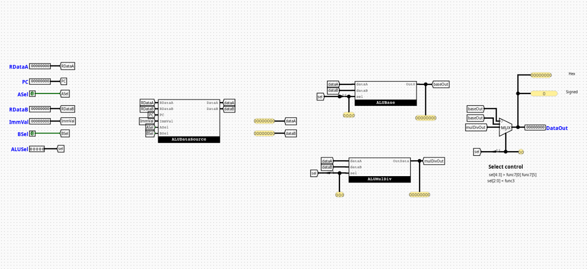

# RiskVALU

---

## Overview

The `RiskVALU` component serves as the central arithmetic, logical, and mathematical acceleration hub of an RV32I processor equipped with the M-extension (RV32IM). It encapsulates distinct functional submodules to handle basic arithmetic, data source routing, control signal extraction, and hardware multiplication/division.

- **Purpose in CPU**: Performs mathematical calculations, logical masking, barrel shifting, and hardware-accelerated integer multiplication, division, and remainder operations.
- **Role in datapath**: Located squarely within the Execution (EX) stage, it accepts operands from the system register file or forwarding paths and generates results targeted for the Memory (MEM) or Writeback (WB) pipelines.

- **Source**: `logisim/RiskVALU.circ`
  

---

## Interface

### Inputs

| Signal   | Width   | Description                                                            |
| -------- | ------- | ---------------------------------------------------------------------- |
| `RDataA` | 32 bits | Raw data output from Register 1 (`rs1`).                               |
| `PC`     | 32 bits | Current program counter address forwarded from the fetch/decode stage. |
| `RDataB` | 32 bits | Raw data output from Register 2 (`rs2`).                               |
| `ImmVal` | 32 bits | Decoded and sign-extended immediate scalar block.                      |
| `ASel`   | 1 bit   | Data routing selection control driving the Operand A multiplexer.      |
| `BSel`   | 1 bit   | Data routing selection control driving the Operand B multiplexer.      |
| `ALUSel` | 5 bits  | Master operational selector bus derived from `funct3` and `funct7`.    |

### Outputs

| Signal   | Width   | Description                                          |
| -------- | ------- | ---------------------------------------------------- |
| `ALUOut` | 32 bits | Final 32-bit aggregated calculation pipeline result. |

---

## Output Logic (Core Definition)

Defines how the top-level outputs are derived based on internal multiplexing logic.

### Rule-based definition

- `dataA` = (`ASel` == 1) ? `PC` : `RDataA`
- `dataB` = (`BSel` == 1) ? `ImmVal` : `RDataB`
- If `ALUSel[4]` (isM) == `0` → `ALUOut` = Derived from `ALUBase` using `ALUSel[3:0]`
- If `ALUSel[4]` (isM) == `1` → `ALUOut` = Derived from `ALUMulDiv` using `ALUSel[2:0]`

---

## Internal Design

The root `RiskVALU` architecture operates as a structural container that routes operands and aggregates results using four specialized internal submodules.

- **Structure**: Purely combinational circuit layout containing zero clocked registers, flip-flops, or internal execution state registers.
- **Subcircuits used**:
  - `ALUDataSource`
  - `ALUControl`
  - `ALUBase`
  - `ALUMulDiv`
- **Decoding / Mux Structure**: Uses an initial pair of 2-to-1 32-bit multiplexers to select input operands, a bit-splitter to slice the control bus, and a final 2-to-1 32-bit multiplexer driven by the `isM` flag to select between the standard or M-extension calculation results.

---

## Operation

Step-by-step behavior:

1. **Inputs arrive**: Data parameters (`RDataA`, `PC`, `RDataB`, `ImmVal`) and control buses (`ASel`, `BSel`, `ALUSel`) land simultaneously at the input boundaries.
2. **Decoding / selection occurs**: `ALUDataSource` resolves the target operands, while `ALUControl` unpacks the execution selection fields.
3. **Logic evaluates conditions**: `ALUBase` and `ALUMulDiv` concurrently evaluate the routed operands along parallel hardware paths.
4. **Outputs are produced**: The final multiplexer switches based on the `isM` mode flag, propagating the selected result onto the `ALUOut` channel within the same combinational cycle window.

---

## Pipeline Interaction

- **Pipeline stage involvement**: Sits completely within the **EX (Execution)** stage tracks.
- **Signal propagation across stages**: Gathers data straight from the ID/EX pipeline registers, allowing calculations to stabilize inside the clock phase before committing the stable state down to the EX/MEM pipeline buffer boundary.
- **Dependencies**: Relies heavily on upstream hazard/forwarding blocks to resolve structural data hazard contentions on operands before execution.

---

## Examples

### Example: MUL Instruction (M-Extension)

Inputs:

- `RDataA` = `0x00000003` (3)
- `RDataB` = `0x00000004` (4)
- `ASel` = `0`, `BSel` = `0`
- `ALUSel` = `10000` (`isM` = 1, `selMD` = 000)

Outputs:

- `ALUOut` = `0x0000000C` (12)

---

## Limitations / Assumptions

- Assumes divide-by-zero criteria default cleanly to overflow presets (`0xFFFFFFFF` or native standard definitions) without triggering separate pipeline traps or core hardware halts.
- Shifter ports inside the core arithmetic modules explicitly discard input lines `dataB[31:5]`, parsing only the lower 5 bits for barrel shift configurations.
- Purely combinational logic layout; contains no standalone clock lines or internal state memory registers.

---

## Implementation Notes (Logisim)

- Built using standard Logisim components only.
- Decoder / mux / gate-based implementation with structural subcircuits.
- No external libraries or third-party logic dependencies.
- Signal widths map rigorously onto standard 1-bit control, 3-bit/4-bit selection buses, and 32-bit execution data registers.

---

## Submodules

### ALUDataSource

Coordinates raw operand routing configurations.

- **Inputs**: `RDataA` (32-bit), `PC` (32-bit), `RDataB` (32-bit), `Imm` (32-bit), `ASel` (1-bit), `BSel` (1-bit)
- **Outputs**: `dataA` (32-bit), `dataB` (32-bit)

#### Logic Definition

- If `ASel` == `0` → `dataA` = `RDataA`
- If `ASel` == `1` → `dataA` = `PC`
- If `BSel` == `0` → `dataB` = `RDataB`
- If `BSel` == `1` → `dataB` = `Imm`

---

### ALUControl

Extracts architectural instruction parameters from the unified control selector to govern individual arithmetic slices.

- **Inputs**: `ALUSel` (5 bits)
- **Outputs**: `selBase` (4 bits), `selMD` (3 bits), `isM` (1 bit)

#### Logic Definition

- `selBase` = `ALUSel[3:0]`
- `selMD` = `ALUSel[2:0]`
- `isM` = `ALUSel[4]`

---

### ALUBase

The fundamental calculation engine for standard RV32I arithmetic. It computes all basic integer arithmetic, shifts, and comparative branches simultaneously in parallel combinational tracks.

- **Inputs**: `dataA` (32-bit), `dataB` (32-bit), `sel` (4-bit control selector)
- **Outputs**: `Out0` (32-bit computed result)

#### Operational Mapping

- `0000`: `dataA + dataB` (Addition)
- `0001`: `dataA << dataB[4:0]` (Logical Shift Left)
- `0010`: `(dataA < dataB) ? 1 : 0` (Signed Set Less Than)
- `0011`: `(dataA <u dataB) ? 1 : 0` (Unsigned Set Less Than)
- `0100`: `dataA ^ dataB` (Bitwise logical XOR)
- `0101`: `dataA >> dataB[4:0]` (Logical Shift Right)
- `0110`: `dataA | dataB` (Bitwise logical OR)
- `0111`: `dataA & dataB` (Bitwise logical AND)
- `1000`: `dataA - dataB` (Subtraction)
- `1101`: `dataA >>> dataB[4:0]` (Arithmetic Shift Right)

---

### ALUMulDiv

The mathematical acceleration submodule that implements structural extensions for the RV32M standard instruction catalog.

- **Inputs**: `dataA` (32-bit), `dataB` (32-bit), `sel` (3-bit functional selector)
- **Outputs**: `Out0` (32-bit evaluated result)

#### Operational Mapping

- `000`: `mul` (Low-order 32 bits of product)
- `001`: `mulh` (High-order 32 bits of signed product)
- `010`: `mulhsu` (High-order 32 bits of product between signed A and unsigned B)
- `011`: `mulhu` (High-order 32 bits of unsigned product)
- `100`: `div` (Signed division quotient)
- `101`: `divu` (Unsigned division quotient)
- `110`: `rem` (Signed division remainder)
- `111`: `remu` (Unsigned division remainder)

#### Internal Execution Mechanics

- **Pre-Processing Complement Blocks**: Uses sign-bit inspection to convert negative inputs into positive magnitudes via two's complement inversion circuits before routing to the division/remainder units.
- **Post-Processing Inversion Matrix**: Applies a conditional post-execution structural two's complement inversion to the calculated division or remainder output if the tracking logic requires a negative result.
- Uses parallel Logisim hardware multipliers and dividers gathered into an 8-to-1 32-bit multiplexer.
