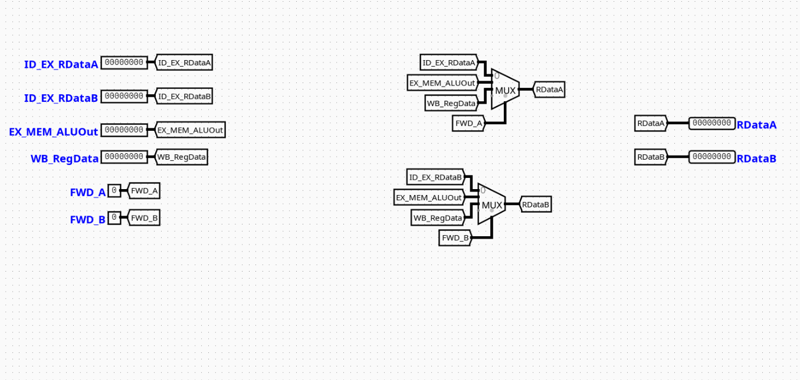

# Forward Control

---

## Overview

The `ForwardControl` component acts as the execution-stage data hazard multiplexing unit for a pipelined RV32I processor. It routes the correct operand data to the Arithmetic Logic Unit (ALU) by selecting between the freshly read register file values or forwarded results from subsequent pipeline stages.

- **Purpose in CPU**: Resolves RAW (Read-After-Write) data hazards dynamically without forcing structural pipeline stalls when data is available ahead of the Writeback stage.
- **Role in datapath**: Sits right before the ALU in the Execution (EX) stage, intercepting standard register read channels to feed the most up-to-date information directly into the execution data paths.

- **Source**: `logisim/RiskVControl.circ`
  

---

## Interface

### Inputs

| Signal          | Width   | Description                                                                              |
| --------------- | ------- | ---------------------------------------------------------------------------------------- |
| `ID_EX_RDataA`  | 32 bits | Baseline register data value read for source register 1 (`rs1`) from the ID stage.       |
| `ID_EX_RDataB`  | 32 bits | Baseline register data value read for source register 2 (`rs2`) from the ID stage.       |
| `EX_MEM_ALUOut` | 32 bits | Execution result calculated by the ALU, forwarded from the Memory stage pipeline buffer. |
| `WB_RegData`    | 32 bits | Writeback-bound data payload derived from either memory operations or ALU calculations.  |
| `FWD_A`         | 2 bits  | Selection control signal determining data derivation pathway for Operand A.              |
| `FWD_B`         | 2 bits  | Selection control signal determining data derivation pathway for Operand B.              |

### Outputs

| Signal   | Width   | Description                                                             |
| -------- | ------- | ----------------------------------------------------------------------- |
| `RDataA` | 32 bits | Final forwarded data value bound for the ALU Operand A input interface. |
| `RDataB` | 32 bits | Final forwarded data value bound for the ALU Operand B input interface. |

---

## Output Logic

Defines how outputs are derived from inputs based on the configuration of multiplexers within the module.

### Rule-based definition

- If `FWD_A` = `00` → `RDataA` = `ID_EX_RDataA` (No forwarding needed)
- If `FWD_A` = `01` → `RDataA` = `EX_MEM_ALUOut` (Forward from Memory stage)
- If `FWD_A` = `10` → `RDataA` = `WB_RegData` (Forward from Writeback stage)

---

- If `FWD_B` = `00` → `RDataB` = `ID_EX_RDataB` (No forwarding needed)
- If `FWD_B` = `01` → `RDataB` = `EX_MEM_ALUOut` (Forward from Memory stage)
- If `FWD_B` = `10` → `RDataB` = `WB_RegData` (Forward from Writeback stage)

---

### Truth table

| `FWD_A` Selection | Output `RDataA` Value      |
| :---------------: | -------------------------- |
|       `00`        | `ID_EX_RDataA`             |
|       `01`        | `EX_MEM_ALUOut`            |
|       `10`        | `WB_RegData`               |
|       `11`        | Open / Unused Output Array |

---

## Internal Design

The `ForwardControl` module relies purely on a twin combinational multiplexer layout designed to minimize signal settlement times within the critical execution track.

- **Structure**: Purely combinational logic design. It operates entirely without integrated clock tracks, edge triggers, or internal state mechanisms.
- **Multiplexer Structure**: Employs two independent 32-bit width 4-to-1 Multiplexers (`Multiplexer` blocks configured with a `select` attribute width of 2).
- **Routing Infrastructure**: Signals enter via input pins mapped straight into localized internal connection lines via named wire labels (`Tunnels`). The multiplexers extract routing instructions dynamically using the 2-bit tracking fields `FWD_A` and `FWD_B` passed into their respective selector inputs.

---

## Operation

1. **Inputs arrive**: The baseline execution tracking values (`ID_EX_RDataA`, `ID_EX_RDataB`) arrive simultaneously alongside bypass values extracted from down-line memory buffers or writeback networks.
2. **Decoding / selection occurs**: The structural configuration lines `FWD_A` and `FWD_B` drive state parameters straight onto the active selection nodes of the twin 4-to-1 multiplexers.
3. **Logic evaluates conditions**: The physical multiplexer gates select the appropriate wire routing track based on the select lines.
4. **Outputs are produced**: Forwarded results are output directly via `RDataA` and `RDataB` within the same execution step clock window.

---

## Pipeline Interaction

- **Pipeline stage involvement**: Sits completely inside the **EX (Execution)** stage environment.
- **Signal propagation across stages**: Monitors feedback channels derived from the boundary borders of both the **EX/MEM** register files and **MEM/WB** output latches.
- **Dependencies**: Acts as the primary resolution element for register data hazards, overriding stale register reads when an instruction currently in flight aims to write to a register needed by the current instruction.

---

## Examples

### Example: Forwarding from Memory Stage (Data Hazard)

Inputs:

- `ID_EX_RDataA` = `0x0000000A`
- `EX_MEM_ALUOut` = `0x000000FF`
- `FWD_A` = `01` (Indicates a hazard match with the previous instruction's destination register)

Outputs:

- `RDataA` = `0x000000FF` (ALU receives the freshly generated arithmetic result rather than the stale register value)

---

## Limitations / Assumptions

- Assumes hazard detection logic outside this circuit computes and sets the `FWD_A` and `FWD_B` selectors correctly.
- Pure combinational logic module; does not possess latch capabilities or internal staging states.
- Assumes the propagation delays across the multi-bit multiplexers fall safely within the timing constraints of the global CPU clock cycle.

---

## Implementation Notes

- Built using standard Logisim components only.
- Relies on default `Plexers` library elements configured for 32-bit data widths and 2 select bits.
- Structured with clean label tunnels to eliminate explicit layout trace clutter.
- No external libraries or third-party logic dependencies.

---
