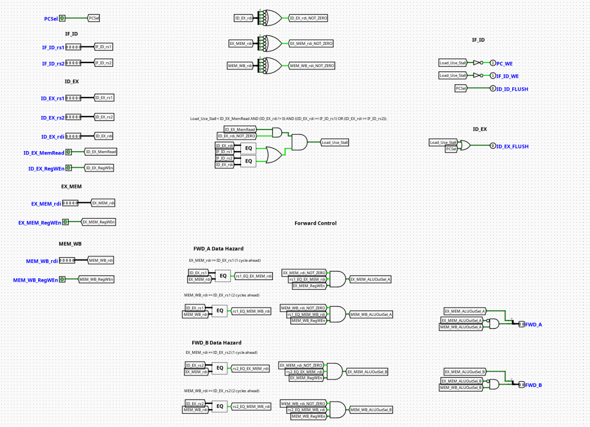

# Hazard Controller

---

## Overview

The `HazardController` acts as the primary pipeline interlock and control protection unit for a pipelined RV32I processor. It dynamically analyzes active instruction source registers against down-pipeline destination states to identify load-use data hazards and branch/jump control hazards, safely stalling or flushing stages to preserve execution integrity.

- **Purpose in CPU**: Coordinates pipeline state hazards by emitting control-flow overrides (`Stall` and `Flush`) when an instruction's required data isn't yet available for forwarding, or when a branch misprediction/jump changes the execution path.
- **Role in datapath**: Intersects the boundaries between the Fetch (IF), Decode (ID), and Execution (EX) pipeline registers to orchestrate synchronous pauses or instruction invalidations.

- **Source**: `logisim/RiskVControl.circ`
  

---

## Interface

### Inputs

| Signal          | Width  | Description                                                                                                                 |
| --------------- | ------ | --------------------------------------------------------------------------------------------------------------------------- |
| `ID_EX_MemRead` | 1 bit  | Active high indicator showing if the instruction currently executing in the EX stage is a memory load command (e.g., `lw`). |
| `ID_EX_rd`      | 5 bits | Destination register address of the instruction currently residing in the Execution (EX) stage.                             |
| `IF_ID_rs1`     | 5 bits | Source register 1 address decoded from the raw instruction in the Instruction Decode (ID) stage.                            |
| `IF_ID_rs2`     | 5 bits | Source register 2 address decoded from the raw instruction in the Instruction Decode (ID) stage.                            |
| `PCSrc`         | 1 bit  | Control signal from the branch/jump execution logic indicating whether a control-flow deviation should be taken.            |

### Outputs

| Signal  | Width | Description                                                                                                                        |
| ------- | ----- | ---------------------------------------------------------------------------------------------------------------------------------- |
| `Stall` | 1 bit | Active high interlock signal used to freeze the Program Counter (PC) register and the IF/ID pipeline latch.                        |
| `Flush` | 1 bit | Active high clear signal used to invalidate stale instructions in the pipeline registers, transforming them into bubbles (`NOP`s). |

---

## Output Logic (Core Definition)

Defines how operational hazards translate into structural control responses across the tracking networks.

### Rule-based definition

#### 1. Load-Use Data Hazard Detection (Stall Logic)

A load-use hazard occurs when an instruction in the Instruction Decode (ID) stage requires a source register that is currently being loaded from data memory by a preceding load instruction in the Execution (EX) stage. Because memory read data is not available until the end of the Memory (MEM) stage, forwarding alone cannot resolve this hazard, and a 1-cycle stall must be inserted.

$$\text{LoadUseHazard} = \text{ID\_EX\_MemRead} \ \& \ ((\text{ID\_EX\_rd} == \text{IF\_ID\_rs1}) \ | \ (\text{ID\_EX\_rd} == \text{IF\_ID\_rs2}))$$

- If $\text{LoadUseHazard} == 1$ and $\text{ID\_EX\_rd} \neq 0$:
  - `Stall` = `1`
- Else:
  - `Stall` = `0`

#### 2. Control Hazard Detection (Flush Logic)

A control hazard occurs when a conditional branch is taken or an unconditional jump executes, altering the sequential execution stream. Instructions that were speculatively fetched behind the branch/jump must be discarded.

- If `PCSrc` = `1`:
  - `Flush` = `1` (Clears the volatile pipeline stage contents to block illegal instruction execution tracking)
- Else:
  - `Flush` = `0`

---

## Internal Design

The module uses purely combinational logic circuits to evaluate condition vectors dynamically within the active clock phase.

- **Structure**: Purely combinational logic framework containing zero sequential elements, flip-flops, or discrete clock paths.
- **Comparators**: Utilizes 5-bit digital equality comparators to monitor matching intersections between the active target register field (`ID_EX_rd`) and upstream decoded decoding registers (`IF_ID_rs1` / `IF_ID_rs2`).
- **Logic Gates**: Standard primitive gates (`AND`, `OR`) compile the hazard matches alongside the status state line `ID_EX_MemRead` to evaluate the load-use penalty. The control hazard signal passes through to the `Flush` output channel to instantly neutralize instruction steps.

---

## Pipeline Interaction

- **Pipeline stage involvement**: Centrally targets the control signals driving the **IF (Instruction Fetch)** and **ID (Instruction Decode)** stage registers.
- **Signal propagation across stages**: Listens to decoded values within the ID stage boundary while simultaneously monitoring memory intent and target registers across the EX stage.
- **Dependencies**: Intersects with the global clock gating lines. When a `Stall` goes high, it typically commands the Program Counter (PC) and IF/ID pipeline registers to hold their current values, while generating a structural `NOP` in the ID/EX register to clear space for the delayed operation.

---

## Examples

### Example 1: Load-Use Hazard Encountered

Inputs:

- `ID_EX_MemRead` = `1` (Preceding instruction is a load, e.g., `lw x5, 0(x10)`)
- `ID_EX_rd` = `0x05` (Targeting destination register `x5`)
- `IF_ID_rs1` = `0x05` (Succeeding instruction requires `x5`, e.g., `add x2, x5, x6`)
- `PCSrc` = `0`

Outputs:

- `Stall` = `1` (Forces the processor to stall the current fetch/decode state for one cycle)
- `Flush` = `0`

---

### Example 2: Branch Taken (Control Hazard)

Inputs:

- `ID_EX_MemRead` = `0`
- `PCSrc` = `1` (Branch comparison evaluates to true; execution path diverts)

Outputs:

- `Stall` = `0`
- `Flush` = `1` (Signals pipeline latches to discard speculatively fetched instructions on the next clock edge)

---

## Limitations / Assumptions

- Assumes register zero (`x0`) handling is cleanly isolated if the hardware allows it, preventing unnecessary structural stalls when an instruction targets `x0`.
- Does not manage deeper multi-cycle dependencies beyond immediate execution/decode phase boundaries; assumes separate structural units or standard forwarding handles standard ALU-to-ALU interactions.
- Relies on clean, hazard-free `PCSrc` calculations from the execution block to avoid erroneous or oscillating flushing loops.

---

## Implementation Notes

- Assembled cleanly using native Logisim `Gates` and `Arithmetic` comparison modules.
- Built without specialized black-box add-ons, ensuring cross-compatibility with standard Logisim-evolution distributions.
- Mapped with clean, descriptive localized `Tunnels` to minimize crossing wires and maximize clarity for troubleshooting and design review.

---
