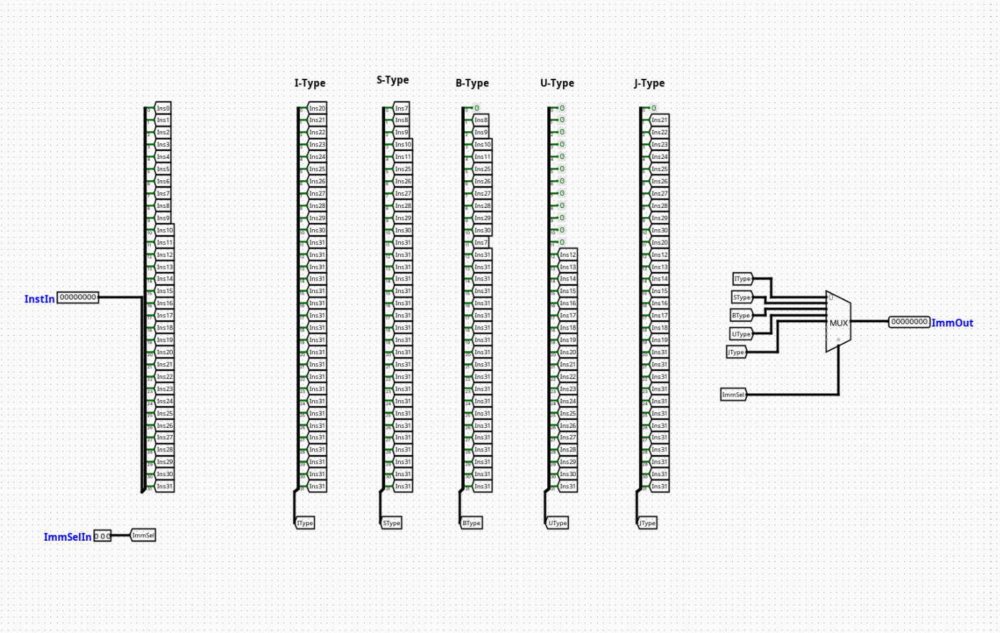

# Immediate Generator

---

## Overview

The `ImmediateGenerator` (ImmGen) is a critical combinatorial component within the Instruction Decode (ID) stage of an RV32I pipelined processor. Its sole responsibility is to extract, reorder, and sign-extend immediate bit fields embedded within various RISC-V instruction formats into a standardized 32-bit two's complement integer value.

- **Purpose in CPU**: Reconstructs broken or scattered immediate constants directly from the raw 32-bit machine code instruction field to supply constants for arithmetic calculations, memory offsets, and branch/jump targets.
- **Role in datapath**: Decodes raw instruction bits coming out of the Instruction Fetch (IF) pipeline register and passes a unified 32-bit scalar output directly down to the ALU operand multiplexers and target program counter calculation blocks.

- **Source**: `logisim/RiskVControl.circ`
  

---

## Interface

### Inputs

| Signal        | Width   | Description                                                                                          |
| ------------- | ------- | ---------------------------------------------------------------------------------------------------- |
| `Instruction` | 32 bits | Raw 32-bit machine language instruction fetched from instruction memory.                             |
| `ImmSel`      | 3 bits  | Structural control routing signal dictating which immediate format variant (I, S, B, U, J) to parse. |

### Outputs

| Signal      | Width   | Description                                                                                 |
| ----------- | ------- | ------------------------------------------------------------------------------------------- |
| `Immediate` | 32 bits | Formatted, re-assembled, and fully sign-extended 32-bit constant value ready for execution. |

---

## Output Logic (Core Definition)

The extraction behavior of the unit is driven entirely by the `ImmSel` configuration line. It maps specific slices of the 32-bit raw instruction input array into an aligned 32-bit wide internal structure.

### Rule-based definition

The following table outlines how the 32-bit immediate string is assembled based on the active `ImmSel` parameter:

| `ImmSel` Value | Format Type | Immediate Bit Mapping Layout (From MSB to LSB)                                                            |
| :------------: | :---------: | --------------------------------------------------------------------------------------------------------- |
|     `000`      | **I-Type**  | `{{20{Instruction[31]}}, Instruction[31:20]}`                                                             |
|     `001`      | **S-Type**  | `{{20{Instruction[31]}}, Instruction[31:25], Instruction[11:7]}`                                          |
|     `010`      | **B-Type**  | `{{19{Instruction[31]}}, Instruction[31], Instruction[7], Instruction[30:25], Instruction[11:8], 1'b0}`   |
|     `011`      | **U-Type**  | `{Instruction[31:12], 12'b0}`                                                                             |
|     `100`      | **J-Type**  | `{{11{Instruction[31]}}, Instruction[31], Instruction[19:12], Instruction[20], Instruction[30:21], 1'b0}` |
|    _Others_    |  _Default_  | Outputs `0x00000000` (or treated as unmapped error states)                                                |

---

## Internal Design

The circuit is purely combinational, containing no state tracking or registers, relying instead on bit-splitting arrays and dynamic multiplexer routing networks.

- **Structure**: Asynchronous combinational topology optimized for low signal-settlement latency within the decoding lifecycle.
- **Bit Slicing & Merging**: Employs standard Logisim `Splitter` blocks to isolate discrete segment offsets from the 32-bit `Instruction` bundle. These disjoint bit groups are combined alongside duplicate sign bits using output bit reconstruction splitters.
- **Sign Extension Mechanics**: Replicates the native instruction sign-bit position (`Instruction[31]`) across higher-order positions using the fan-out properties of wire splitting nodes to achieve automated two's complement alignment.
- **Output Multiplexing**: Features a single 32-bit width 8-to-1 Multiplexer (`Multiplexer` configured with a 3-bit selection bus driven by `ImmSel`) to route the correctly reconstructed format out to the `Immediate` pin.

---

## Pipeline Interaction

- **Pipeline stage involvement**: Sits entirely inside the **ID (Instruction Decode)** stage of the processing track.
- **Signal propagation across stages**: Operates immediately downstream of the IF/ID pipeline register boundary, stabilizing its output before the next clock edge latches the values into the ID/EX pipeline buffer.
- **Dependencies**: Acts as a fundamental slave device to the main CPU Control Unit, which must supply the correct matching `ImmSel` code based on the opcode field of the incoming instruction.

---

## Examples

### Example 1: I-Type Extraction (e.g., `addi x1, x2, -4`)

- **Input Instruction**: `0xFFC10093` (`Instruction[31]` = `1`)
- **Control Vector**: `ImmSel` = `000`
- **Internal Mechanics**: Extracts `Instruction[31:20]` which equals `0xFFC`. Replicates bit 31 twenty times (`0xFFFFF`).
- **Output Immediate**: `0xFFFFFFFC` (Decimal `-4`)

---

### Example 2: U-Type Extraction (e.g., `lui x1, 0x12345`)

- **Input Instruction**: `0x123450B7`
- **Control Vector**: `ImmSel` = `011`
- **Internal Mechanics**: Extracts `Instruction[31:12]` (`0x12345`) and appends 12 low-order trailing zero bits (`0x000`).
- **Output Immediate**: `0x12345000`

---

## Limitations / Assumptions

- Assumes that byte-alignment, instruction fetching, and operational bounds have already been fully verified by upstream logic elements.
- Implicitly handles the unaligned bit configurations characteristic of standard RISC-V specifications (such as the scrambled bit indexing in B and J types designed to optimize fan-out configurations in physical hardware layouts).
- The low-order bit 0 for both B-Type and J-Type output tracks is tied explicitly to a hardware ground constant (`0`), enforcing the required 2-byte instruction alignment standard for branch offsets.

---

## Implementation Notes

- Built cleanly out of default `Wiring` (Splitters, Tunnels) and `Plexers` (Multiplexers) logic blocks from the standard Logisim library suite.
- Uses explicit label naming structures inside all tracking tunnels to maintain clarity and easily isolate specific bit groupings during testing.
- No clock dependencies or complex external functional libraries are imported.

---
