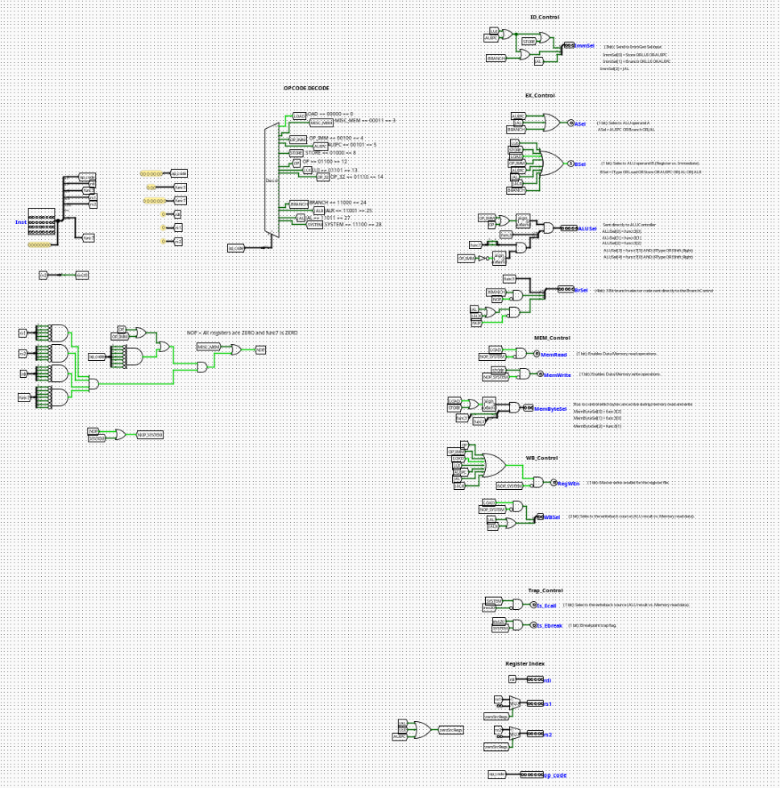

# Main Control Unit

---

## Overview

The **Main Control Unit** decodes the 32-bit instruction word and generates all control signals required to drive the datapath for one instruction cycle. It is the central decision-making block of the CPU — every downstream unit (ALU, register file, memory, branch logic, immediate generator) receives its operating mode from signals produced here.

- **Purpose in CPU:** Decode the current instruction and assert the correct combination of control signals for every pipeline stage.
- **Role in datapath:** Sits in the ID stage; its outputs fan out to the EX, MEM, and WB stages as well as to the branch and immediate generation units.

- **Source**: `logisim/RiskVControl.circ`
  

---

## Interface

### Inputs

| Signal       | Width | Description                                                   |
| ------------ | ----- | ------------------------------------------------------------- |
| `Inst[31:0]` | 32    | Full 32-bit instruction word fetched from instruction memory. |

### Outputs

The outputs are grouped by the pipeline stage they control.

#### ID Control

| Signal        | Width | Description                                                                                                                                              |
| ------------- | ----- | -------------------------------------------------------------------------------------------------------------------------------------------------------- |
| `ImmSel[2:0]` | 3     | Immediate format selector sent to the Immediate Generator. `ImmSel[0]` = STORE \| LUI \| AUIPC. `ImmSel[1]` = BRANCH \| LUI \| AUIPC. `ImmSel[2]` = JAL. |

#### EX Control

| Signal        | Width | Description                                                                                                                                                                                                |
| ------------- | ----- | ---------------------------------------------------------------------------------------------------------------------------------------------------------------------------------------------------------- |
| `ASel`        | 1     | Selects ALU operand A. Asserted for AUIPC, BRANCH, and JAL (uses PC); deasserted for register.                                                                                                             |
| `BSel`        | 1     | Selects ALU operand B. Asserted for I-type, LOAD, STORE, AUIPC, JAL, JALR (uses immediate); deasserted for register. `BSel = IType OR LOAD OR STORE OR AUIPC OR JAL OR JALR`.                              |
| `ALUSel[4:0]` | 5     | ALU operation selector sent directly to the ALU Controller. `ALUSel[2:0]` = `funct3[2:0]`. `ALUSel[3]` = `funct7[5]` AND (R-type OR IShift_Right). `ALUSel[4]` = `funct7[0]` AND (R-type OR IShift_Right). |
| `BrSel[4:0]`  | 5     | Branch selector bus sent to the Branch Control Unit. Encodes `funct3`, `Is_Branch`, and `Is_Jump`.                                                                                                         |

#### MEM Control

| Signal            | Width | Description                                                                                                                                                                   |
| ----------------- | ----- | ----------------------------------------------------------------------------------------------------------------------------------------------------------------------------- |
| `MemRead`         | 1     | Enables Data Memory read operations. Asserted for LOAD only.                                                                                                                  |
| `MemWrite`        | 1     | Enables Data Memory write operations. Asserted for STORE only.                                                                                                                |
| `MemByteSel[2:0]` | 3     | Controls which bytes are active during memory read/write. Derived from `funct3`: `MemByteSel[0]` = `funct3[2]`, `MemByteSel[1]` = `funct3[0]`, `MemByteSel[2]` = `funct3[1]`. |

#### WB Control

| Signal       | Width | Description                                                                              |
| ------------ | ----- | ---------------------------------------------------------------------------------------- |
| `RegWEn`     | 1     | Master write-enable for the register file. Deasserted for STORE, BRANCH, and NOP/SYSTEM. |
| `WBSel[1:0]` | 2     | Selects the writeback source (ALU result, memory read data, or PC+4).                    |

#### Trap Control

| Signal      | Width | Description                                                      |
| ----------- | ----- | ---------------------------------------------------------------- |
| `Is_Ecall`  | 1     | Asserted when the instruction is an `ecall` system call.         |
| `Is_Ebreak` | 1     | Breakpoint trap flag. Asserted when the instruction is `ebreak`. |

#### Register Index Passthrough

| Signal         | Width | Description                                                                          |
| -------------- | ----- | ------------------------------------------------------------------------------------ |
| `op_code[6:0]` | 7     | Raw opcode field passed through to downstream units.                                 |
| `rdi[4:0]`     | 5     | Destination register index (`Inst[11:7]`).                                           |
| `rs1[4:0]`     | 5     | Source register 1 index (`Inst[19:15]`). Zeroed for instructions that have no `rs1`. |
| `rs2[4:0]`     | 5     | Source register 2 index (`Inst[24:20]`). Zeroed for instructions that have no `rs2`. |

---

## Output Logic (Core Definition)

### Opcode Decode Table

The 7-bit opcode field (`Inst[6:0]`) is decoded by a 5-bit splitter (bits `[6:2]`) feeding a 32-output decoder. Each named tunnel corresponds to one opcode:

| Opcode Name | `op[6:2]` (binary) | Decimal |
| ----------- | ------------------ | ------- |
| `LOAD`      | `00000`            | 0       |
| `MISC_MEM`  | `00011`            | 3       |
| `OP_IMM`    | `00100`            | 4       |
| `AUIPC`     | `00101`            | 5       |
| `STORE`     | `01000`            | 8       |
| `OP`        | `01100`            | 12      |
| `LUI`       | `01101`            | 13      |
| `OP_32`     | `01110`            | 14      |
| `BRANCH`    | `11000`            | 24      |
| `JALR`      | `11001`            | 25      |
| `JAL`       | `11011`            | 27      |
| `SYSTEM`    | `11100`            | 28      |

### Rule-based definition

- If opcode = `LOAD`:
  - `MemRead` = 1, `RegWEn` = 1, `BSel` = 1, `ALUSrc` = register + immediate (ADD)
- If opcode = `STORE`:
  - `MemWrite` = 1, `RegWEn` = 0, `BSel` = 1
- If opcode = `OP` (R-type):
  - `RegWEn` = 1, `ASel` = 0, `BSel` = 0, `ALUSel` driven by `funct3` + `funct7`
- If opcode = `OP_IMM` (I-type):
  - `RegWEn` = 1, `ASel` = 0, `BSel` = 1, `ALUSel[2:0]` = `funct3`
- If opcode = `BRANCH`:
  - `RegWEn` = 0, `ASel` = 1, `BSel` = 0, `BrSel[3]` (`Is_Branch`) = 1
- If opcode = `JAL`:
  - `RegWEn` = 1, `ASel` = 1, `BSel` = 1, `BrSel[4]` (`Is_Jump`) = 1, `ImmSel[2]` = 1
- If opcode = `JALR`:
  - `RegWEn` = 1, `ASel` = 0, `BSel` = 1, `BrSel[4]` (`Is_Jump`) = 1
- If opcode = `LUI`:
  - `RegWEn` = 1, `ImmSel[0]` = 1, `ImmSel[1]` = 1, `zeroSrcRegs` = 1
- If opcode = `AUIPC`:
  - `RegWEn` = 1, `ASel` = 1, `BSel` = 1, `ImmSel[0]` = 1, `ImmSel[1]` = 1
- If opcode = `SYSTEM`:
  - `Is_Ecall` or `Is_Ebreak` asserted based on `inst[20]`; all other control signals deasserted (treated as NOP)
- If NOP (all register fields and `funct7` = zero):
  - All control signals deasserted

### Boolean expressions

```
ASel   = AUIPC OR BRANCH OR JAL
BSel   = OP_IMM OR LOAD OR STORE OR AUIPC OR JAL OR JALR
RegWEn = NOT(NOP_SYSTEM) AND NOT(STORE) AND NOT(BRANCH)
MemRead  = LOAD AND NOT(NOP_SYSTEM)
MemWrite = STORE AND NOT(NOP_SYSTEM)

ImmSel[0] = STORE OR LUI OR AUIPC
ImmSel[1] = BRANCH OR LUI OR AUIPC
ImmSel[2] = JAL

ALUSel[2:0] = funct3[2:0]
ALUSel[3]   = funct7[5] AND (OP OR IShift_Right)
ALUSel[4]   = funct7[0] AND (OP OR IShift_Right)

MemByteSel[0] = funct3[2]
MemByteSel[1] = funct3[0]
MemByteSel[2] = funct3[1]
```

---

## Internal Design

The circuit is structured into the following functional zones:

- **Instruction Splitter:** A 32-bit splitter at the `Inst` input distributes instruction fields to named tunnels: `op_code[6:0]`, `funct3[2:0]`, `funct7[6:0]`, `rdi[4:0]`, `rs1[4:0]`, `rs2[4:0]`, and `inst20` (bit 20, used for SYSTEM decode).
- **Opcode Decoder:** The upper 5 bits of the opcode (`op_code[6:2]`) feed a 32-output decoder (lib Plexers). Each active decoder output drives a named tunnel corresponding to an instruction type (LOAD, STORE, OP, etc.).
- **NOP Detection:** Four AND gates with all inputs inverted check that `rs1`, `rs2`, `rdi`, and `funct7` are all zero. Their combined output asserts the `NOP` tunnel.
- **NOP_SYSTEM:** An OR gate combines `NOP` and `SYSTEM` into a shared suppression signal used to gate `MemRead`, `MemWrite`, and `RegWEn`.
- **Control Signal Logic:** Each output signal is derived from OR/AND gate networks over the decoded opcode tunnels, as described in the boolean expressions above. Key structures include:
  - A 7-input OR gate for `WBSel` and `RegWEn`.
  - A 3-bit AND gate (with NOT on `NOP_SYSTEM`) for `MemByteSel`.
  - A 5-bit AND gate for `ALUSel` passthrough gating.
  - A 2-to-1 MUX each for `rs1` and `rs2` zeroing when `zeroSrcRegs` is asserted (LUI, JAL, AUIPC).
- **Register Index Passthrough:** `rdi`, `rs1`, and `rs2` are passed through directly. For instructions with no source registers (LUI, JAL, AUIPC), the `zeroSrcRegs` signal selects constant `0x0` on the MUX output instead.
- **SYSTEM Decode:** `inst20` (bit 20 of the instruction word) distinguishes `ecall` (0) from `ebreak` (1) when `SYSTEM` is active. An AND gate with inverted `inst20` drives `Is_Ecall`; an AND gate without inversion drives `Is_Ebreak`.

All logic is purely combinational. No registers or flip-flops are present.

---

## Operation

1. `Inst[31:0]` arrives from Instruction Memory via the IF/ID pipeline register.
2. The 32-bit splitter distributes instruction fields to named tunnels throughout the circuit.
3. The 5-bit opcode (`Inst[6:2]`) is decoded by the 32-output decoder; the matching output line goes high.
4. NOP detection logic checks all register fields and `funct7` for all-zero; asserts `NOP` if true.
5. `NOP_SYSTEM` is formed by OR-ing `NOP` and `SYSTEM`, gating memory and register write enables.
6. All control outputs are resolved combinationally through their respective gate networks in the same cycle.
7. Outputs fan out to the ID/EX pipeline register, the Branch Control Unit, the Immediate Generator, and the register file read ports.

---

## Pipeline Interaction

- Active in the **ID stage**; all outputs are registered into the **ID/EX pipeline register** at the end of the cycle.
- `ImmSel` is consumed by the Immediate Generator in the same ID stage cycle.
- `BrSel` is consumed by the Branch Control Unit in the same ID stage cycle.
- `ALUSel`, `ASel`, `BSel` propagate to the **EX stage**.
- `MemRead`, `MemWrite`, `MemByteSel` propagate to the **MEM stage**.
- `RegWEn`, `WBSel` propagate to the **WB stage**.
- When a NOP or flush is injected into the pipeline, `NOP_SYSTEM` suppresses all write-enabling outputs, effectively making the instruction a no-op.

---

## Examples

### Example: ADD (R-type)

Inputs:

- `Inst` = `0x00208033` (ADD x0, x1, x2)
- `op[6:2]` = `01100` (OP), `funct3` = `000`, `funct7[5]` = 0

Outputs:

- `ALUSel` = `00000`, `ASel` = 0, `BSel` = 0, `RegWEn` = 1, `MemRead` = 0, `MemWrite` = 0

### Example: LW (LOAD)

Inputs:

- `op[6:2]` = `00000`, `funct3` = `010`

Outputs:

- `MemRead` = 1, `BSel` = 1, `RegWEn` = 1, `ImmSel` = `000`, `MemByteSel` = `010` (word)

### Example: SW (STORE)

Inputs:

- `op[6:2]` = `01000`, `funct3` = `010`

Outputs:

- `MemWrite` = 1, `BSel` = 1, `RegWEn` = 0, `MemByteSel` = `010`

### Example: BEQ (BRANCH)

Inputs:

- `op[6:2]` = `11000`, `funct3` = `000`

Outputs:

- `ASel` = 1, `BSel` = 0, `RegWEn` = 0, `BrSel` = `01000` (`Is_Branch`=1, `funct3`=000)

### Example: JAL

Inputs:

- `op[6:2]` = `11011`

Outputs:

- `ASel` = 1, `BSel` = 1, `RegWEn` = 1, `ImmSel` = `100` (JAL), `BrSel[4]` = 1 (`Is_Jump`)

### Example: LUI

Inputs:

- `op[6:2]` = `01101`

Outputs:

- `RegWEn` = 1, `ImmSel` = `011`, `zeroSrcRegs` = 1 (`rs1` = 0, `rs2` = 0)

### Example: NOP

Inputs:

- `Inst` = `0x00000013` (ADDI x0, x0, 0 — canonical NOP)
- All register fields and `funct7` = zero

Outputs:

- All write enables deasserted (`RegWEn` = 0, `MemRead` = 0, `MemWrite` = 0)

---

## Limitations / Assumptions

- Assumes valid RV32I instruction encoding on `Inst[31:0]`.
- `OP_32` (64-bit extension opcodes) is decoded but not fully handled — outputs are not defined for this opcode in the current implementation.
- `MISC_MEM` (FENCE) is decoded but treated as a passthrough with no memory ordering enforcement.
- No exception handling for illegal or malformed instruction encodings.
- SYSTEM instruction decode is limited to `ecall`/`ebreak` via `inst20`; no CSR instruction handling.
- NOP detection relies on all register fields and `funct7` being zero — non-standard NOPs may not be caught.
- Combinational propagation delay not modeled.

---

## Implementation Notes (Logisim)

- Single input pin: `Inst[31:0]`.
- Instruction fields distributed via a multi-fanout splitter with named tunnel labels.
- Opcode decoded using a Logisim Plexers `Decoder` component with a 5-bit select input (`op_code[6:2]`).
- Named tunnels used extensively to route signals across the circuit without long wire runs.
- `rs1` and `rs2` zero-suppression implemented with 2-to-1 MUX components controlled by `zeroSrcRegs`.
- `MemByteSel` formed by a 3-bit AND gate gated with `NOT(NOP_SYSTEM)`.
- `ALUSel` formed by a 5-bit AND gate combining `funct3`/`funct7` bits with opcode qualifiers.
- All standard Logisim-evolution components; no external libraries.
- Signal widths follow RV32I spec.
