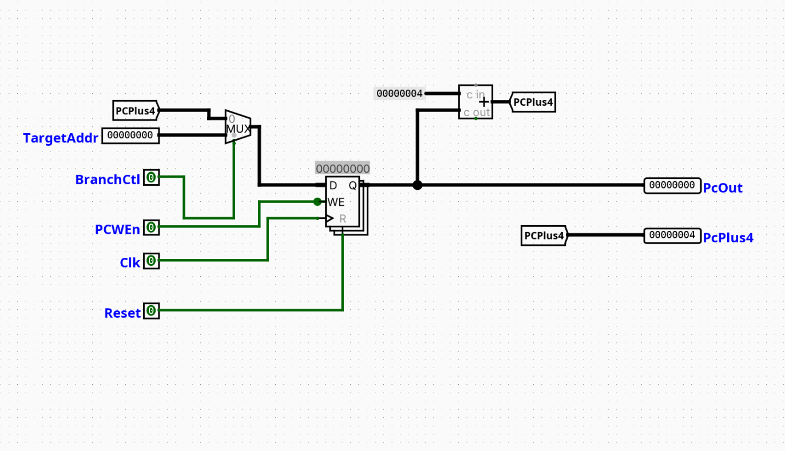

# ProgramCounter

---

## Overview

The `ProgramCounter` component is responsible for holding and updating the address of the current instruction to be fetched and executed by the processor. It supports sequential instruction execution by incrementing the address by 4, as well as non-sequential execution paths such as branches and jumps.

- **Purpose in CPU**: Tracks the instruction address to drive the Instruction Memory.
- **Role in datapath**: Lies at the core of the Instruction Fetch (IF) stage, determining the next instruction address based on control signals from subsequent stages.

- **Source**: `logisim/RiskVControl.circ`
  

---

## Interface

### Inputs

| Signal       | Width | Description                                                                                                    |
| ------------ | ----- | -------------------------------------------------------------------------------------------------------------- |
| `TargetAddr` | 32    | The target address for a branch or jump instruction.                                                           |
| `BranchCtl`  | 1     | Control signal that determines whether to take the branch target address ($1$) or continue sequentially ($0$). |
| `PCWEn`      | 1     | Program Counter Write Enable; when asserted ($1$), allows the PC register to update on the rising clock edge.  |
| `Clk`        | 1     | System clock signal.                                                                                           |
| `Reset`      | 1     | Clear signal to reset the PC register value to $0$.                                                            |

### Outputs

| Signal    | Width | Description                                                   |
| --------- | ----- | ------------------------------------------------------------- |
| `PcOut`   | 32    | The current address stored in the Program Counter.            |
| `PcPlus4` | 32    | The sequential next instruction address ($\text{PcOut} + 4$). |

---

## Output Logic (Core Definition)

Defines how outputs are derived from inputs.

### Rule-based definition (preferred)

- **Combinational Outputs**:
  - $\text{PcPlus4} = \text{PcOut} + 4$

- **Sequential Updates (on the rising edge of `Clk`)**:
  - If `Reset` = 1 $\rightarrow$ $\text{PcOut} = 0\text{x}00000000$
  - If `Reset` = 0 and `PCWEn` = 1:
    - If `BranchCtl` = 0 $\rightarrow$ $\text{PcOut} = \text{PcPlus4}$
    - If `BranchCtl` = 1 $\rightarrow$ $\text{PcOut} = \text{TargetAddr}$
  - If `Reset` = 0 and `PCWEn` = 0 $\rightarrow$ $\text{PcOut}$ retains its previous state.

---

### Optional: Boolean expressions (only if useful)

$$\text{NextPC} = (\text{TargetAddr} \cdot \text{BranchCtl}) + (\text{PcPlus4} \cdot \overline{\text{BranchCtl}})$$

---

## Internal Design

The `ProgramCounter` is implemented using a mix of standard combinational and sequential Logisim blocks:

- **Sequential Structure**: Uses a 32-bit Logisim `Register` to hold the stable state of the current instruction address (`PcOut`).
- **Combinational Structure**:
  - A 32-bit 2-to-1 `Multiplexer` selects between the sequential path (`PCPlus4`) and the control-flow alteration path (`TargetAddr`) using the `BranchCtl` line as the select bit.
  - A 32-bit `Adder` computes the address of the next word-aligned instruction by summing the register's current output (`PcOut`) with a 32-bit `Constant` of value $0\text{x}4$.
  - Internal routing is clean and modularized via `Tunnel` components for the `PCPlus4` feedback loop.

---

## Operation

Step-by-step behavior:

1. **Inputs arrive**: The current control signals (`BranchCtl`, `PCWEn`, `Reset`) and target address (`TargetAddr`) stabilize at the inputs.
2. **Decoding / selection occurs**: The 2-to-1 multiplexer evaluates the state of `BranchCtl` and routes either `PCPlus4` or `TargetAddr` to the input ($D$) port of the register.
3. **Logic evaluates conditions**: Concurrently, the 32-bit adder sums the active `PcOut` with $4$ to update the `PCPlus4` tunnel and drive the `PcPlus4` output pin.
4. **Outputs are produced (clocked)**: On the rising edge of `Clk`, the register checks `Reset` and `PCWEn`. If `PCWEn` is asserted and `Reset` is low, the register updates its stored value to match the multiplexer's output, changing `PcOut` for the next cycle.

---

## Pipeline Interaction (if applicable)

- Used directly in the **Instruction Fetch (IF)** stage.
- Outputs control information (`PcPlus4`) down to the ID/EX stages via pipeline registers to compute jump targets or store return link addresses (e.g., for `JAL`/`JALR`).
- Interacts with hazard detection units via the `PCWEn` line to stall the pipeline by preventing the PC from advancing.

---

## Examples

### Example: Sequential Execution (e.g., standard ADD instruction)

Inputs:

- `TargetAddr` = $0\text{x}00001000$
- `BranchCtl` = 0
- `PCWEn` = 1
- Stored `PcOut` = $0\text{x}00000004$

Outputs:

- `PcOut` = $0\text{x}00000004$ (updates to $0\text{x}00000008$ on the next valid clock edge)
- `PcPlus4` = $0\text{x}0000000\text{C}$

---

### Example: Branch Taken (e.g., BEQ evaluates to true)

Inputs:

- `TargetAddr` = $0\text{x}00002040$
- `BranchCtl` = 1
- `PCWEn` = 1
- Stored `PcOut` = $0\text{x}000000A0$

Outputs:

- `PcOut` = $0\text{x}000000A0$ (updates to $0\text{x}00002040$ on the next valid clock edge)
- `PcPlus4` = $0\text{x}000000A4$

---

## Limitations / Assumptions

- Assumes instruction memory references are always word-aligned ($4$-byte increments); unaligned or compressed instruction formats (such as the RV32C extension) are not supported.
- Traps, exceptions, or hardware interrupts are unhandled within this component.
- The propagation delay of the internal adder and multiplexer is assumed to be within the allowable cycle-time constraints of the global system clock.

---

## Implementation Notes (Logisim)

- Built entirely using standard Logisim components from the `Wiring`, `Gates`, `Plexers`, `Arithmetic`, and `Memory` libraries.
- No third-party or external libraries are required.
- All primary datapath signal buses maintain strict 32-bit compliance with the RV32I base specification.
