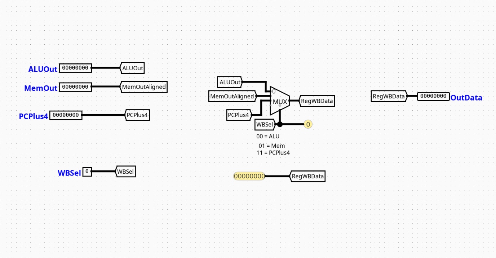

# WriteBackController

---

## Overview

The `WriteBackController` component handles structural routing at the final destination boundary of a pipelined RV32I processor. It functions as a data-path routing multiplexer that determines which computed result or memory payload gets committed back to the processor's Core Register File during the Writeback (WB) phase.

- **Purpose in CPU**: Consolidates separate asynchronous execution channels into a single synchronized register commitment path, preventing structural bus contentions.
- **Role in datapath**: Positioned at the terminal boundary of the Memory/Writeback (MEM/WB) pipeline interface, collecting data payloads from the execution and storage units to feed back into the destination register write input channel (`rd`).

- **Source**: `logisim/RiskVControl.circ`
  

---

## Interface

### Inputs

| Signal    | Width   | Description                                                                                             |
| --------- | ------- | ------------------------------------------------------------------------------------------------------- |
| `ALUOut`  | 32 bits | Mathematical or logical data output forwarded from the computation unit (ALU).                          |
| `MemOut`  | 32 bits | Data payload read out from Random Access Data Memory (RAM) during a load operation.                     |
| `PCPlus4` | 32 bits | Incremented program counter sequence value tracking the sequential instruction pathway (`PC + 4`).      |
| `WBSel`   | 2 bits  | Structural multi-bit routing control line dictating which data stream maps to the destination register. |

### Outputs

| Signal    | Width   | Description                                                                                                |
| --------- | ------- | ---------------------------------------------------------------------------------------------------------- |
| `WB_Data` | 32 bits | Standardized 32-bit payload routed directly to the master write data channel of the central Register File. |

---

## Output Logic (Core Definition)

Defines how data outputs are structurally isolated and routed based on the status configuration of the tracking network lines.

### Rule-based definition (preferred)

- If `WBSel` = `00` → `WB_Data` = `ALUOut` (Routes standard computational or address generation results)
- If `WBSel` = `01` → `WB_Data` = `MemOut` (Routes memory data payloads retrieved via load commands)
- If `WBSel` = `11` → `WB_Data` = `PCPlus4` (Routes link addresses for jump-and-link operations)

---

### Optional: Truth table (only when necessary)

| `WBSel` Selector | Output `WB_Data` Value | Operational Intent                                              |
| :--------------: | ---------------------- | --------------------------------------------------------------- |
|       `00`       | `ALUOut`               | Register Writeback from computation (R-type, I-type arithmetic) |
|       `01`       | `MemOut`               | Register Writeback from storage tracking (`lw`)                 |
|       `10`       | _Unused / Default_     | Reserved path                                                   |
|       `11`       | `PCPlus4`              | Return address execution recording (`jal`, `jalr`)              |

---

## Internal Design

The `WriteBackController` features a clean, low-latency combinational topology engineered to settle routing channels instantly within the final phase window.

- **Structure**: Purely combinational circuit layout containing zero clocked registers, flip-flops, or discrete state latches.
- **Multiplexer Layout**: Employs a single multi-bit 4-to-1 Multiplexer (`Multiplexer` component derived from the `Plexers` library group configured for a data tracking bit-width of 32 and a selection width of 2).
- **Routing Infrastructure**: Directs physical terminal interfaces onto internal connection tracks via named wire labels (`Tunnels`). The multiplexer extracts selection configurations via the 2-bit routing tunnel `WBSel` hooked directly into its control pin.

---

## Operation

Step-by-step behavior:

1. **Inputs arrive**: Data arrays from the ALU calculation unit (`ALUOut`), memory data bus (`MemOut`), and sequence link path (`PCPlus4`) appear at the multiplexer inputs.
2. **Decoding / selection occurs**: The central control block applies a stable 2-bit state parameter directly to the `WBSel` multiplexer select lines.
3. **Logic evaluates conditions**: The combinational plexer gates establish a direct structural link between the selected input channel and the output terminal.
4. **Outputs are produced**: The target data stream settles on the `WB_Data` channel, making it immediately available for latching into the Register File on the next active clock edge.

---

## Pipeline Interaction

- **Pipeline stage involvement**: Centered strictly within the **WB (Writeback)** stage environment.
- **Signal propagation across stages**: Monitors signals latched across the MEM/WB pipeline registers to convert them into a stable return stream.
- **Dependencies**: Operates downstream of the main control distribution architecture; relies on the system controller to decode the active instruction type and maintain stable `WBSel` values across the execution window.

---

## Examples

### Example: Memory Load Return (e.g., `lw x10, 0(x5)`)

Inputs:

- `ALUOut` = `0x200000A0` (Computed data storage address)
- `MemOut` = `0xABCDEF12` (Actual value read from RAM at that address)
- `PCPlus4` = `0x00000044`
- `WBSel` = `01`

Outputs:

- `WB_Data` = `0xABCDEF12` (Routes the data read from memory back to register `x10`)

---

## Limitations / Assumptions

- Assumes that data sign-extension or byte-alignment handling for memory operations has already been computed by processing blocks upstream.
- Purely combinational logic structure; does not include built-in timing elements or data holding latches.
- Relies entirely on the external control system to avoid configuring the module into unmapped or invalid states (e.g., state `10`).

---

## Implementation Notes

- Built using native Logisim `Plexers` and `Wiring` components.
- Configured strictly using standard multi-bit bus lines matching standard RV32I design specifications.
- Implements organized local tunnel networks to avoid overlapping signal lines and trace clutter.

---
