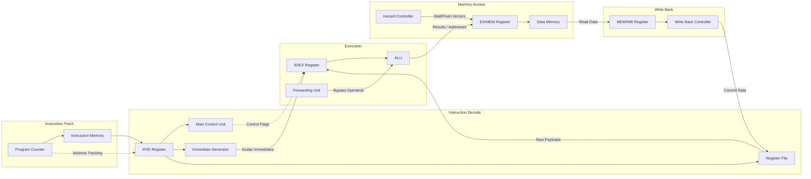

# CPU Components Overview

---

## The Modular Datapath Layout

The Risk-V processor core is designed using a modular, decoupled structural schema. Rather than routing complex wire buses haphazardly across the top-level schematic, the architecture isolates specific operations into dedicated logical components. These components interact via strictly specified pin-out interfaces and are separated by synchronous stage registers to form a high-performance 5-stage pipeline.

The entire core is divided into four structural categories: **Control Unit Components**, **Arithmetic Hardware**, **Memory Core Interfaces**, and **Pipeline Separation Registers**.

---

## Structural Component Categorization

### 1. Control Subsystems

Control hardware continuously evaluates instructions in flight, decoding execution parameters, resolving architectural hazards, and steering the forwarding pathways.

- **Main Control Unit (`components/control/main-controller.md`)**: The central combinational decoding matrix. It interprets the `opcode` bitfield to establish baseline control flags across the datapath.
- **Immediate Generator (`components/control/immediate-generator.md`)**: Extracts and reorganizes non-contiguous instruction bits to construct sign-extended 32-bit scalar constants for I, S, B, U, and J-type instructions.
- **Hazard Controller (`components/control/hazard-controller.md`)**: The internal structural supervisor. It tracks structural interlocks (such as load-use hazards) and branches, manipulating pipeline register write-enables and flush vectors.
- **Forwarding Unit (`components/control/forward-controller.md`)**: Maximizes execution throughput by continuously comparing target register writes against execution source inputs, bypassing stale Register File values in real time.
- **Branch Control Unit (`components/control/branch-controller.md`)**: Evaluates branch comparison statuses (equality, signedness, magnitude) against the `funct3` instruction field to actuate next-PC target selections.
- **Write Back Controller (`components/control/writeback-controller.md`)**: Implements terminal steering logic, selecting whether the ALU result, Data Memory read payload, or sequential link address commits to the Register File.
- **Program Counter (`components/control/program-counter.md`)**: A synchronous, edge-triggered 32-bit register tracking the active instruction address string, featuring inline write gating for pipeline stalls.

### 2. Arithmetic Components

Arithmetic components execute raw mathematical, bitwise, and logical functions.

- **ALU (`components/arithmetic/alu.md`)**: The central execution macro-block. It accepts dual 32-bit operands and processes them according to a 5-bit operational selector code to execute addition, subtraction, bit-shifts, and logical operations.

### 3. Memory Architectures

Memory blocks manage volatile data state storage across processing cycles.

- **Register File (`components/memory/register-file.md`)**: A fast, dual-read, single-write structural storage array containing 32 independent integer registers (`x0` through `x31`), with register `x0` permanently hardwired to zero.
- **Data Memory (`components/memory/data-memory.md`)**: The internal data storage interface (`DMem`), encapsulating physical synchronous RAM cells and combining them with combinational steering networks (`StoreAligner`, `MaskGenerator`, `LoadAligner`) to support byte-, halfword-, and word-aligned reads and writes.

### 4. Pipeline Boundary Registers

Isolation registers divide the clock-cycle datapath into independent execution stages.

- **IF/ID Register (`components/pipeline/if-id.md`)**: Latches fetched instructions and tracking PC metrics, executing synchronous clears to inject NOP bubbles on branch mispredictions.
- **ID/EX Register (`components/pipeline/id-ex.md`)**: Buffers decoded register operands, sign-extended immediates, structural index lines, and execution control flags.
- **EX/MEM Register (`components/pipeline/ex-mem.md`)**: Registers ALU calculation results, forwarded store metrics, target destination pointers, and memory control states.
- **MEM/WB Register (`components/pipeline/mem-wb.md`)**: Stabilizes memory read outputs, bypassed ALU metrics, and destination index configurations to prepare them for commit into the Register File.

---

## Inter-Component Communication Abstract

The following data-flow diagram tracks the horizontal distribution of information across the hardware boundaries. Control flags generated in early stages are passed down-line through the isolation boundaries alongside raw data words to ensure that operations remain synchronized with their associated instructions.

---

## Core Operational Assumptions

1.  **Clock Distribution**: All sequential modules (`Program Counter`, `Register File`, `Data Memory`, and the four stage registers) connect to a single, global, non-skewed system clock network (`SysClk`).
2.  **Edge Triggering**: State transformations occur strictly on the rising (positive) edge of the system clock, while combinational propagation stabilizes during the intervening low-and-high phase windows.
3.  **Hazard Priority**: When structural conflicts happen simultaneously, stall assertions from the Hazard Controller override downstream execution commands to prevent unaligned memory tracking errors or register corruption.
