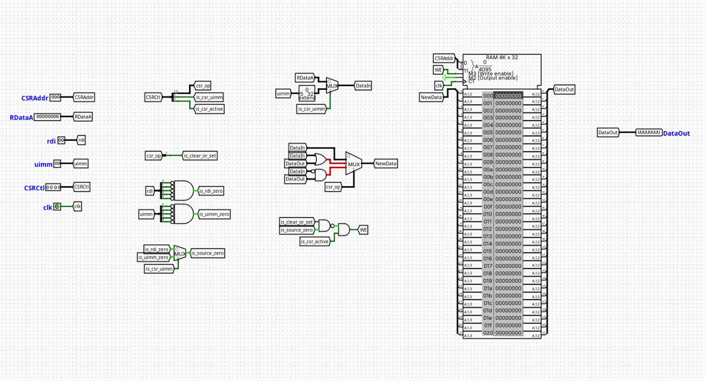

# CSR Unit (Control and Status Register)

---

## Overview

The CSR Unit provides the structural storage and bitwise manipulation logic required to support the RISC-V Zicsr standard extension. It handles the state tracking for status, counter, and control registers.

- **Purpose in CPU**: Executes atomic read-and-modify operations on Control and Status Registers (CSRs), allowing the processor to interface with system-level control registers, privilege modes, and performance counters.
- **Role in datapath**: Positioned in the Memory (MEM) stage of the pipeline. It reads the current register state to supply the Writeback (WB) path for the general-purpose register file (`rd`) before executing the requested bitwise modifications via an internal transformation matrix and writing the updated value back to the internal RAM on the clock edge.

- **Source**: `logisim/RiskVMemory.circ`
  

---

## Interface

### Inputs

| Signal    | Width | Description                                                                                                                    |
| --------- | ----- | ------------------------------------------------------------------------------------------------------------------------------ |
| `CSRAddr` | 12    | The 12-bit absolute address specifying which CSR register to access (from the instruction payload).                            |
| `RDataA`  | 32    | The forwarded data value read from general-purpose register `rs1`, used as the operand for register-source variants.           |
| `rdi`     | 5     | The raw 5-bit register source index from the instruction (`instruction[19:15]`), used for register-zero detection.             |
| `uimm`    | 5     | The raw 5-bit immediate value payload from the instruction (`instruction[19:15]`), used for immediate-zero detection.          |
| `CSRCtl`  | 4     | Packed unified control bus: `CSRCtl[3]` = Active flag, `CSRCtl[2]` = Source selection, `CSRCtl[1:0]` = Bitwise operation code. |
| `clk`     | 1     | Master system clock signal driving the synchronous write operations of the internal storage block.                             |

### Outputs

| Signal    | Width | Description                                                                                                            |
| --------- | ----- | ---------------------------------------------------------------------------------------------------------------------- |
| `DataOut` | 32    | The **old read data** extracted from the CSR memory block _prior_ to modification, routed to the WB stage multiplexer. |

---

## Output Logic (Core Definition)

Defines how outputs and internal write behaviors are derived from inputs.

### Rule-based definition

- **Master Execution Validation**:
  - `is_csr_active` = `CSRCtl[3]`
  - `is_csr_uimm` = `CSRCtl[2]`
  - `csr_op` = `CSRCtl[1:0]`

- **Zero-Operand Suppression Loop**:
  - If `rdi == 5'b00000` → `is_rdi_zero = 1`
  - If `uimm == 5'b00000` → `is_uimm_zero = 1`
  - `is_source_zero` = `is_csr_uimm` ? `is_uimm_zero` : `is_rdi_zero`

- **Modifier Instruction Extraction**:
  - `is_clear_or_set` = `csr_op[1]` (Evaluates high for `CSRRS`, `CSRRC`, `CSRRSI`, `CSRRCI`)

- **Write Enable Generation (`WE`)**:
  - If `is_csr_active == 1` and `(is_clear_or_set NAND is_source_zero) == 1` → `WE = 1`
  - Otherwise → `WE = 0`

- **Internal Data Modification (`NewData`)**:
  - If `csr_op == 2'b01` (Write Variant: `CSRRW`, `CSRRWI`) → `NewData = DataIn`
  - If `csr_op == 2'b10` (Set Variant: `CSRRS`, `CSRRSI`) → `NewData = DataOut OR DataIn`
  - If `csr_op == 2'b11` (Clear Variant: `CSRRC`, `CSRRCI`) → `NewData = DataOut AND (NOT DataIn)`

---

### Boolean expressions

```pascal
is_clear_or_set = CSRCtl[1]
is_source_zero  = (CSRCtl[2]) ? is_uimm_zero : is_rdi_zero

WE = CSRCtl[3] AND (is_clear_or_set NAND is_source_zero)
```

---

## Internal Design

The component utilizes a mixed combinational and synchronous sequential layout to ensure atomic operation parameters are honored within a single execution cycle:

- **Control Demultiplexing**: A multi-bit splitter fractures the 4-bit `CSRCtl` bus into standalone control tunnels (`is_csr_active`, `is_csr_uimm`, `csr_op`). A separate 2-bit splitter processes `csr_op` to decode the `is_clear_or_set` parameter.
- **Zero-Detection Network**: Multi-input `AND` gates featuring bitwise-inverted inputs independently evaluate the 5-bit `rdi` and `uimm` buses to detect zero-value conditions. A 2-to-1 multiplexer driven by `is_csr_uimm` chooses the appropriate zero flag, outputting to `is_source_zero`.
- **Operand Data Source Selection**: A 32-bit zero-extender expands the 5-bit `uimm` literal to 32 bits. A 32-bit 2-to-1 multiplexer driven by `is_csr_uimm` selects between `RDataA` and the zero-extended value, establishing the internal `DataIn` bus.
- **Bitwise ALU Matrix**: Houses parallel combinational gate networks (a bitwise `OR` gate and a bitwise `AND` gate with an inverted input leg for `DataIn`). The transformation outputs feed into a 32-bit 4-to-1 multiplexer driven by `csr_op` to resolve the final `NewData` bus.
- **Sequential Storage Element**: Utilizes the built-in Logisim synchronous RAM block configured for a 12-bit address space (`CSRAddr`) and a 32-bit data width. The `WE` input port is driven by the gated logic matrix, the `D` input port receives the calculated `NewData` bus, and the `RE` (Read Enable) pin is wired permanently high via a `Power` terminal to bypass synchronous read latency.

---

## Operation

Step-by-step behavior during a single execution clock cycle:

1. **Inputs Arrive**: The `CSRAddr`, `RDataA`, `rdi`, `uimm`, and `CSRCtl` signals stabilize at the component inputs.
2. **Read Phase (Instantaneous)**: The address `CSRAddr` accesses the transparent RAM block, which immediately drives its output port to establish the `DataOut` tunnel. This value leaves the component immediately to satisfy the destination register writeback path.
3. **Decoding and Selection**: The `CSRCtl` splitter isolates the control fields. The zero-detection blocks determine if the current operand mask is zero, while the input multiplexer builds the 32-bit `DataIn` bus.
4. **Logic Evaluation**: The internal bitwise ALU matrix computes the alternative `NewData` transformation variants concurrently. The 4-to-1 multiplexer handles selection based on `csr_op` to present the update profile to the memory write port. Concurrently, the gated `NAND`/`AND` array resolves the `WE` pin status.
5. **Clock Edge Sync**: Upon the arrival of the positive clock edge (`clk`), if `WE` is asserted, the value on the `NewData` bus is locked into the register slot addressed by `CSRAddr`.

---

## Pipeline Interaction

- **Pipeline Stage Involvement**: Implemented structurally inside the Memory (MEM) stage.
- **Signal Propagation**: Receives its configuration parameters and data references from the `EX/MEM` pipeline register boundaries.
- **Dependencies & Hazards**: The master validation bit `CSRCtl[3]` (`is_csr_active`) is exported to the processor's centralized Hazard Controller from the ID, EX, and MEM stages. If a structural collision is detected on `CSRAddr` across consecutive instructions, the Hazard Controller drops `PC_Write_Enable` and `IF_ID_Write_Enable` while flushing the `ID/EX` boundaries to enforce a single-cycle hardware bubble.

---

## Examples

### Example: CSRRS Instruction (Register Set, Source != x0)

Inputs:

- `CSRCtl` = `4'b1010` (`is_csr_active = 1`, `is_csr_uimm = 0`, `csr_op = 2'b10`)
- `rdi` = `5'b00101` (`x5`)
- `RDataA` = `32'h000000FF` (Set mask)
- `RAM[CSRAddr]` = `32'hF0000000` (Initial state)

Outputs / Internal State Transitions:

- `is_clear_or_set` = `1`
- `is_source_zero` = `0`
- `WE` = `1 AND (1 NAND 0)` = `1` (Write authorized)
- `DataOut` = `32'hF0000000` (Original state exported to register file writeback)
- `NewData` = `32'hF0000000 | 32'h000000FF` = `32'hF00000FF` (Committed to RAM on clock edge)

---

## Limitations / Assumptions

- Assumes a valid Zicsr instruction payload formatting.
- No hardware privilege mode verification or access violation trapping is implemented.
- Pure combinational propagation delay through the bitwise processing gates is unmodeled.

---

## Implementation Notes (Logisim)

- Built using native Logisim-Evolution standard component structures only.
- The RAM element requires a constant high logic state connected to its `RE` input port to preserve single-cycle datapath performance constraints.
- Signal widths map strictly to the standard RV32Zicsr architectural blueprint.
