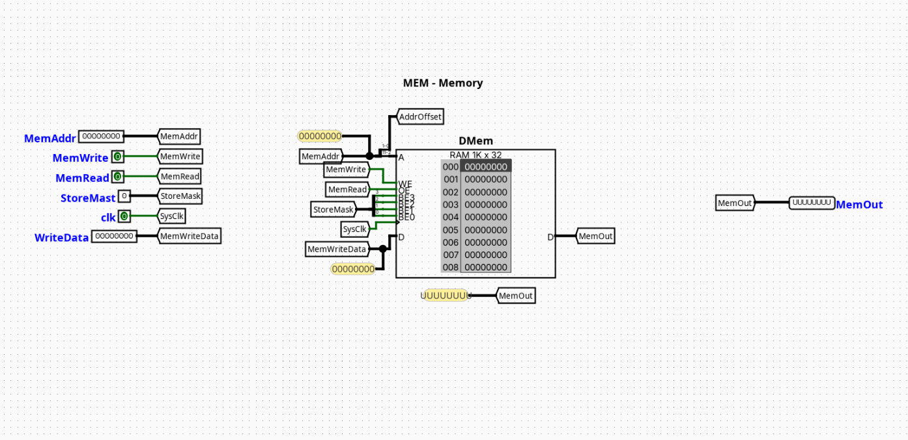
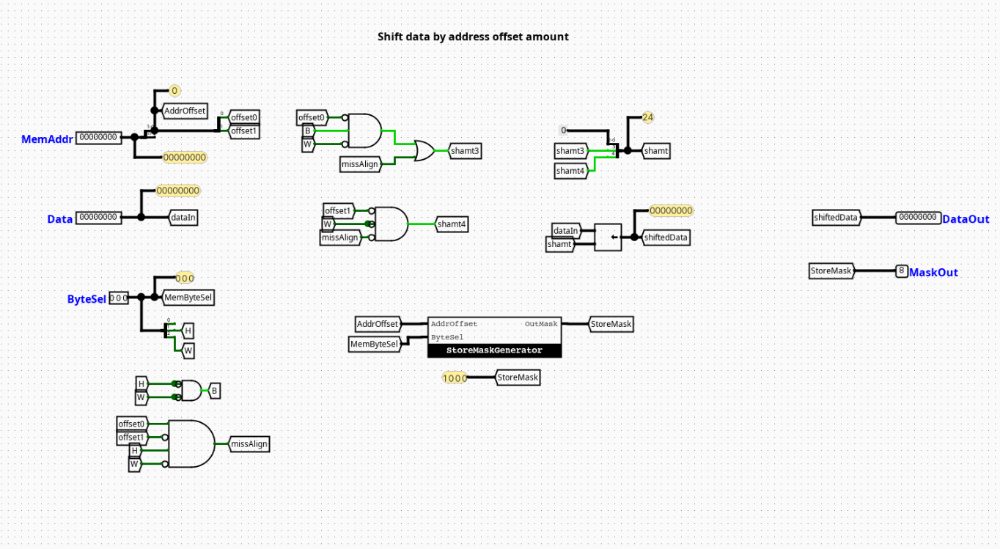
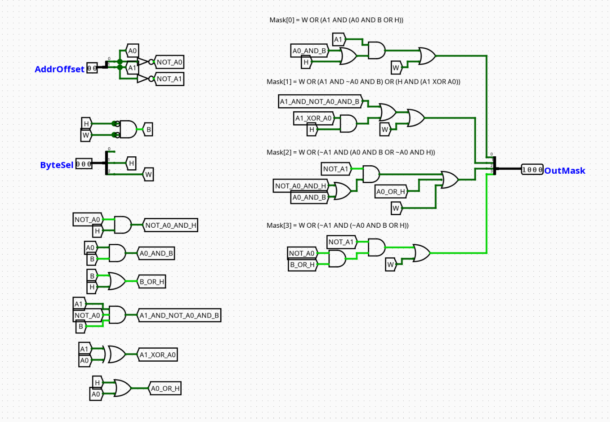
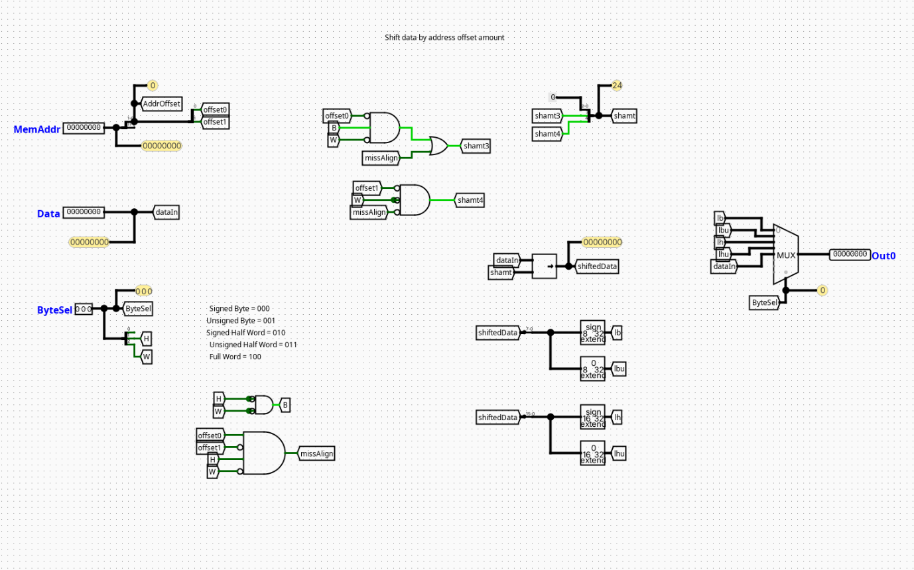

# DMem

---

## Overview

The `DMem` component acts as the unified Data Memory interface module for a pipelined RV32I processor. It encapsulates physical synchronous Random Access Memory (RAM) and supplements it with byte-alignment, masking, and sign-extension hardware networks. This allows the processor to natively execute word (`lw`), halfword (`lh`, `lhu`), and byte (`lb`, `lbu`) memory operations seamlessly.

- **Purpose in CPU**: Handles volatile data read and write preservation operations during program execution.
- **Role in datapath**: Operates inside the Memory (MEM) pipeline stage, reading or writing data payloads based on addresses computed in the upstream Execution (EX) stage.

- **Source**: `logisim/RiskVMemory.circ`
  

---

## Interface

### Inputs

| Signal     | Width   | Description                                                                                |
| ---------- | ------- | ------------------------------------------------------------------------------------------ |
| `clk`      | 1 bit   | Master system clock signal link for synchronizing write operations.                        |
| `MemWrite` | 1 bit   | Master write enable flag. When active, data is written into memory on the next clock edge. |
| `Addr`     | 32 bits | Raw 32-bit execution byte address calculated by the ALU.                                   |
| `WData`    | 32 bits | Raw 32-bit source data word to be stored in memory.                                        |
| `Func3`    | 3 bits  | Format specification vector derived directly from the instruction's `funct3` bit field.    |

### Outputs

| Signal  | Width   | Description                                                                                        |
| ------- | ------- | -------------------------------------------------------------------------------------------------- |
| `RData` | 32 bits | Fully formatted and properly sign- or zero-extended 32-bit data word returned to the CPU datapath. |

---

## Output Logic (Core Definition)

The configuration of top-level outputs and storage modifications are governed dynamically by the internal submodules based on address offsets and structural control configurations.

### Rule-based definition (preferred)

- **Memory Addressing**: Standardizes on word-aligned execution by routing `Addr[31:2]` directly to the internal RAM cell address bus.
- **Data Write Path**: When `MemWrite` == `1`, the byte-enable pins of the RAM cell are modulated by the 4-bit block generated by `MaskGenerator`, while `StoreAligner` shifts `WData` to line up with the target byte offsets.
- **Data Read Path**: `RData` is continuously evaluated combinationally from the raw RAM output payload by `LoadAligner` using `Addr[1:0]` and `Func3`.

---

## Internal Design

The `DMem` module uses a modular architecture that separates write-side formatting, byte-mask generation, physical storage, and read-side extension into dedicated subcircuits.

- **Structure**: Core storage operates sequentially on the master clock edge, while formatting, steering, and bit-extension submodules operate entirely as combinational networks.
- **Subcircuits Used**:
  - `StoreAligner`: Aligns write payloads to specific byte channels.
  - `MaskGenerator`: Generates byte-enabling vector configurations.
  - `LoadAligner`: Filters and extends read data.
- **Top-Level Routing**: The address bus is split; `Addr[31:2]` is wired straight to the core RAM address lines, while `Addr[1:0]` routes downstream to the alignment and mask-generation submodules to configure byte lanes.

---

## Operation

Step-by-step behavior:

1. **Parameters Settle**: `Addr`, `WData`, `Func3`, and `MemWrite` land at the input ports.
2. **Parallel Submodule Evaluation**: `MaskGenerator` creates the write mask, `StoreAligner` repositions the write word, and the RAM block combinationally outputs the 32-bit word located at `Addr[31:2]`.
3. **Read Alignment**: `LoadAligner` intercepts the raw RAM output, isolating and extending the correct sub-word based on `Addr[1:0]` and `Func3` to deliver a stable value to `RData`.
4. **Synchronous State Change**: If `MemWrite` is asserted, the masked and shifted write data commits to the RAM cells on the next active clock transition.

---

## Pipeline Interaction (if applicable)

- **Pipeline stage involvement**: Operates entirely within the **MEM (Memory Access)** pipeline stage window.
- **Signal propagation across stages**: Accepts execution addresses directly from the EX/MEM pipeline registers and stabilizes the fully formatted read values (`RData`) before the next clock edge latches them into the MEM/WB writeback registers.
- **Dependencies**: Interlocks directly with data hazard mitigation architectures. Because memory operations take a full clock cycle to read from storage, any immediate dependent instruction down-line requires the central pipeline controller to introduce a structural stall cycle to preserve data consistency.

---

## Examples

### Example: Storing a Byte (e.g., `sb x5, 2(x10)`)

Inputs:

- `Addr` = `0x10000006` (`Addr[1:0]` = `10`)
- `WData` = `0x11223344` (Low byte to write = `0x44`)
- `Func3` = `000` (Byte mode)
- `MemWrite` = `1`

Submodule Actions:

- `StoreAligner` shifts `0x44` to position 2, generating `0x00440000`.
- `MaskGenerator` outputs a 4-bit write mask of `0100`.
- **Result**: On the clock edge, only byte lane 2 of the word address `0x10000004` is updated with `0x44`.

---

## Limitations / Assumptions

- Assumes memory access constraints match the natural size-alignment protocols dictated by standard RISC-V specifications. Unaligned memory accesses may trigger erroneous wrapping behavior if not isolated externally.
- Contains no exception tracking, misaligned memory trap hooks, or hardware-level bus parity checks.
- Purely dependent on stable clock transitions to handle structural operations without corrupting nearby data segments.

---

## Implementation Notes (Logisim)

- Built cleanly using standard elements from Logisim's native `Memories` (RAM), `Plexers` (Multiplexers), and `Wiring` packages.
- Configured with a unified local tunnel system to cleanly distribute address byte slices (`Addr[1:0]`) and format controls without visual clutter.

---

## Submodules

### StoreAligner

#### Overview

A combinational steering network that shifts lower-order bits from the source register to align them with the target byte coordinates within the 32-bit memory word.

- **Source**: `logisim/RiskVMemory.circ`
  

#### Interface

- **Inputs**: `WData` (32 bits), `Addr_LSB` (2 bits, tracking `Addr[1:0]`)
- **Outputs**: `Aligned_WData` (32 bits)

#### Logic Definition

- If `Addr_LSB` == `00` → `Aligned_WData` = `WData`
- If `Addr_LSB` == `01` → `Aligned_WData` = `WData[23:0] << 8` (Low byte moved to Byte 1)
- If `Addr_LSB` == `10` → `Aligned_WData` = `WData[15:0] << 16` (Low half/byte moved to Byte 2)
- If `Addr_LSB` == `11` → `Aligned_WData` = `WData[7:0] << 24` (Low byte moved to Byte 3)

---

### MaskGenerator

#### Overview

An operational decoding matrix that translates the instruction size code (`Func3`) and address offsets into a 4-bit byte-enable vector used to gate RAM write transactions.

- **Source**: `logisim/RiskVMemory.circ`
  

#### Interface

- **Inputs**: `Func3` (3 bits), `Addr_LSB` (2 bits, tracking `Addr[1:0]`)
- **Outputs**: `Write_Mask` (4 bits, mapped directly to RAM byte-enables)

#### Logic Definition

- **Byte Mode (`Func3` == `000`)**:
  - `Addr_LSB` == `00` → `Write_Mask` = `0001`
  - `Addr_LSB` == `01` → `Write_Mask` = `0010`
  - `Addr_LSB` == `10` → `Write_Mask` = `0100`
  - `Addr_LSB` == `11` → `Write_Mask` = `1000`
- **Halfword Mode (`Func3` == `001`)**:
  - `Addr_LSB` == `00` → `Write_Mask` = `0011`
  - `Addr_LSB` == `10` → `Write_Mask` = `1100`
- **Word Mode (`Func3` == `010`)**:
  - `Write_Mask` = `1111`
- **Default/Other Modes**: `Write_Mask` = `0000`

---

### LoadAligner

#### Overview

An extraction and sign-extension framework that captures sub-word selections from memory and formats them into standardized 32-bit integers.

- **Source**: `logisim/RiskVMemory.circ`
  

#### Interface

- **Inputs**: `RAM_DataOut` (32 bits), `Addr_LSB` (2 bits, tracking `Addr[1:0]`), `Func3` (3 bits)
- **Outputs**: `RData` (32 bits)

#### Logic Definition

Extracts and pads values based on the active memory format configuration:

- **`Func3` == `000` (Byte Load - `lb`)**:
  - `Addr_LSB` == `00` → `RData` = `{{24{RAM_DataOut[7]}}, RAM_DataOut[7:0]}`
  - `Addr_LSB` == `01` → `RData` = `{{24{RAM_DataOut[15]}}, RAM_DataOut[15:8]}`
  - `Addr_LSB` == `10` → `RData` = `{{24{RAM_DataOut[23]}}, RAM_DataOut[23:16]}`
  - `Addr_LSB` == `11` → `RData` = `{{24{RAM_DataOut[31]}}, RAM_DataOut[31:24]}`
- **`Func3` == `001` (Halfword Load - `lh`)**:
  - `Addr_LSB` == `00` → `RData` = `{{16{RAM_DataOut[15]}}, RAM_DataOut[15:0]}`
  - `Addr_LSB` == `10` → `RData` = `{{16{RAM_DataOut[31]}}, RAM_DataOut[31:16]}`
- **`Func3` == `010` (Word Load - `lw`)**:
  - `RData` = `RAM_DataOut`
- **`Func3` == `100` (Byte Load Unsigned - `lbu`)**:
  - `Addr_LSB` == `00` → `RData` = `{24'b0, RAM_DataOut[7:0]}`
  - `Addr_LSB` == `01` → `RData` = `{24'b0, RAM_DataOut[15:8]}`
  - `Addr_LSB` == `10` → `RData` = `{24'b0, RAM_DataOut[23:16]}`
  - `Addr_LSB` == `11` → `RData` = `{24'b0, RAM_DataOut[31:24]}`
- **`Func3` == `101` (Halfword Load Unsigned - `lhu`)**:
  - `Addr_LSB` == `00` → `RData` = `{16'b0, RAM_DataOut[15:0]}`
  - `Addr_LSB` == `10` → `RData` = `{16'b0, RAM_DataOut[31:16]}`

```

```
