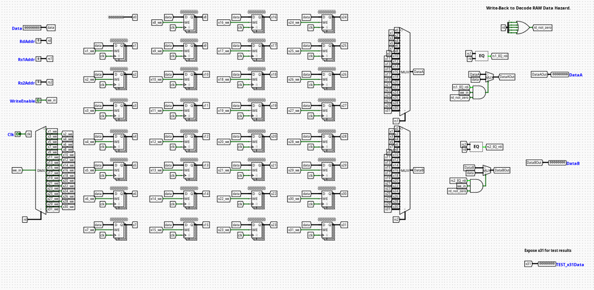

# Register File

---

## Overview

The `RegisterFile` component acts as the centralized high-speed architectural storage unit within the Instruction Decode (ID) stage of the pipelined RV32I processor. It holds the 32 general-purpose registers (`x0` through `x31`) that serve as fast-access operands for arithmetic, logic, and memory processing paths.

- **Purpose in CPU**: Temporarily stores variable data and instruction results, enabling rapid concurrent dual-register reads alongside a synchronized single-register write operation within each clock cycle.
- **Role in datapath**: Positioned within the Instruction Decode (ID) stage, it accepts decoded source addresses directly from the raw instruction bus to serve data to the execution stage, while capturing finalized return streams from the Writeback (WB) stage.

- **Source**: `logisim/RiskVMemory.circ`
  

---

## Interface

### Inputs

| Signal     | Width   | Description                                                                           |
| ---------- | ------- | ------------------------------------------------------------------------------------- |
| `clk`      | 1 bit   | Master system clock signal synchronization link.                                      |
| `RegWrite` | 1 bit   | Active-high control signal enabling state modifications to be committed to the file.  |
| `RadrA`    | 5 bits  | Source Register 1 (`rs1`) address mapping bus tracking the active instruction field.  |
| `RadrB`    | 5 bits  | Source Register 2 (`rs2`) address mapping bus tracking the active instruction field.  |
| `Wadr`     | 5 bits  | Destination Register (`rd`) address mapping bus identifying where to write back data. |
| `WData`    | 32 bits | Decided 32-bit data payload arriving from the Writeback stage to commit into storage. |

### Outputs

| Signal   | Width   | Description                                                      |
| -------- | ------- | ---------------------------------------------------------------- |
| `RDataA` | 32 bits | Current 32-bit word read from the location specified by `RadrA`. |
| `RDataB` | 32 bits | Current 32-bit word read from the location specified by `RadrB`. |

---

## Output Logic (Core Definition)

Defines how read channels reflect internal storage states while conforming to RISC-V structural constraints and data consistency optimizations.

### Rule-based definition

- **Register `x0` Hardwiring**:
  - If `RadrA` == `00000` → `RDataA` = `0x00000000`
  - If `RadrB` == `00000` → `RDataB` = `0x00000000`

- **Transparent Internal Bypass (Write-First Behavior)**:
  - If `RegWrite` == `1` and `Wadr` != `00000` and `Wadr` == `RadrA` → `RDataA` = `WData`
  - If `RegWrite` == `1` and `Wadr` != `00000` and `Wadr` == `RadrB` → `RDataB` = `WData`

- **Standard Storage Routing**:
  - If none of the conditions above match for `RadrA` → `RDataA` = `Register_Array[RadrA]`
  - If none of the conditions above match for `RadrB` → `RDataB` = `Register_Array[RadrB]`

---

## Transparent Register Functionality (Internal Bypass)

To maximize pipeline performance and eliminate avoidable data delays, the component includes built-in transparent register logic (also known as a write-first register file bypass).

- **The Problem**: In a standard design, a register write occurs on the clock edge, while a register read is continuous and combinational. When an instruction in the Writeback stage commits data to a register that the current instruction in the Decode stage is attempting to read simultaneously, a raw structural delay would ordinarily occur, serving stale data until the next cycle.
- **The Solution**: Digital equality comparators inside the circuit monitor the live execution tracks. If `RegWrite` is active and the destination address `Wadr` matches either read address (`RadrA` or `RadrB`), internal bypass multiplexers intercept the standard register array output. Instead of delivering the older data sitting inside the latch arrays, the module forwards the incoming `WData` directly to `RDataA` or `RDataB` within the exact same clock cycle.
- **Architectural Benefit**: This achieves 0-cycle structural forwarding for immediate back-to-back instructions entering writeback and decode stages, removing the need for the central hazard controller to force pipeline stalls for this specific data conflict scenario.

---

## Internal Design

The `RegisterFile` consists of an array of synchronous storage blocks surrounding an asynchronous combinational reading and transparent bypassing framework.

- **Combinational vs Sequential Structure**: The primary writing pathway is strictly sequential, synchronized to the edge of the master clock. Conversely, the read matching networks, equality checking logic, and bypass multiplexers are purely combinational to update output states dynamically within the active phase window.
- **Register Storage Array**: Composed of 31 independent 32-bit edge-triggered registers representing architectural nodes `x1` through `x31`. Physical register `x0` is omitted from the sequential array and tied directly to a hardware ground constant block.
- **Decoding & Write-Gating Architecture**: Incoming address `Wadr` drives a 5-to-32 digital Demultiplexer line decoder. The output lines are combinatially gated with the `RegWrite` enable flag via standard `AND` logic blocks to derive independent write-enable signals for each physical register.
- **Bypass Logic & Mux Matrix**: Incorporates 5-bit identity comparators that cross-examine `Wadr` against `RadrA` and `RadrB`. The comparative output flags drive 2-to-1 32-bit multiplexers sitting directly on the final output stages of the primary 32-channel read selectors, forcing immediate propagation of `WData` when an address intersection is confirmed.

---

## Operation

Step-by-step behavior:

1. **Addresses and Data Arrive**: Decoded register address fields (`RadrA`, `RadrB`, `Wadr`) and target write data (`WData`) settle on their respective input tracking lines.
2. **Parallel Address Comparisons**: Internal equality comparators evaluate if `Wadr` matches `RadrA` or `RadrB` while checking the active state of `RegWrite`.
3. **Bypass Evaluation**: If a match is detected, the bypass multiplexer switches its input channel away from the register array bus and hooks directly onto the incoming `WData` stream.
4. **Asynchronous Read Delivery**: The final output streams settle continuously onto `RDataA` and `RDataB`, cleanly outputting either the stored historical values or the dynamically bypassed writeback data.
5. **Synchronized State Commitment**: If `RegWrite` is asserted and `Wadr` is not zero, the data vector sitting on the `WData` bus latches into the target storage register precisely on the next active system clock transition.

---

## Pipeline Interaction (if applicable)

- **Pipeline stage involvement**: Operates within the **ID (Instruction Decode)** stage for instruction parsing, while interfacing with the trailing edge of the **WB (Writeback)** stage for data preservation.
- **Signal propagation across stages**: Extracted data payloads flow directly downstream to the EX stage forwarding multiplexers. Write loops track values across the complete pipeline lifecycle, returning via terminal pipeline feedback loops.
- **Dependencies**: The internal transparency circuit resolves local ID/WB stage conflicts autonomously. Deeper execution dependencies (such as EX-to-ID or MEM-to-ID conflicts) must still be intercepted and managed by external pipeline forwarding networks or hazard controllers.

---

## Examples

### Example: Simultaneous Read-Write Intersect (Bypass Active)

Inputs:

- `RegWrite` = `1`
- `Wadr` = `0x05` (Writing back to register `x5`)
- `WData` = `0xDEADBEEF` (New computational result)
- `RadrA` = `0x05` (Decode stage needs to read `x5` concurrently)
- `RadrB` = `0x02` (Reading unconflicted register `x2`)

Outputs / State Changes:

- `RDataA` = `0xDEADBEEF` (Bypass intercepts the path; data is delivered instantly via transparency logic without waiting for the clock edge)
- `RDataB` = Retrieves the standard historical value stored in `x2` from the register array.
- **On Next Clock Edge**: Storage slot `x5` officially commits the value `0xDEADBEEF` into its internal static memory latches.

---

## Limitations / Assumptions

- Assumes register `x0` remains read-only as zero; the transparent bypass logic suppresses forwarding alerts for address `00000` to prevent erroneous data passing if an instruction attempts to target or read `x0`.
- Purely combinational bypass path; layout trace propagation delays must be accounted for to ensure the bypass output stabilizes safely before the execution stage samples the data lines.

---

## Implementation Notes

- Built strictly from native Logisim `Memories` (Registers), `Plexers` (Multiplexers/Demultiplexers), `Arithmetic` (Comparators), and `Wiring` components.
- Scaled to conform to 32-bit data pathways and 5-bit register field address limitations.
- Avoids overlapping layout lines by nesting connections inside clearly declared localized tunnel flags.

---
