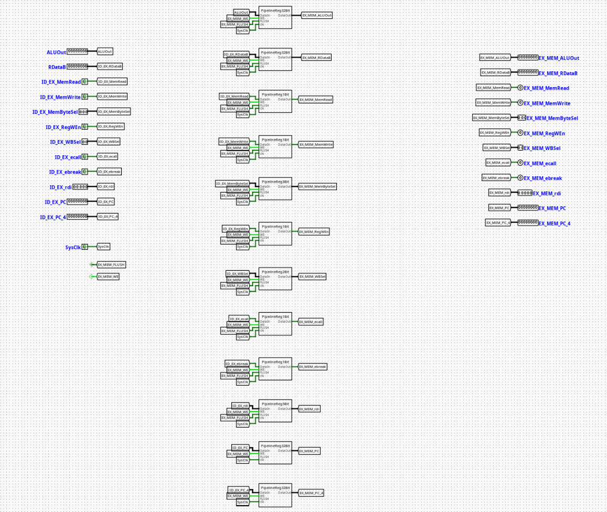

# EX | MEM Pipeline Register

# EX_MEM

---

## Overview

The `EX_MEM` component serves as the localized pipeline stage boundary register isolating the Execution (EX) stage from the Memory Access (MEM) stage of a pipelined RV32I processor. It synchronizes and preserves control paths, computation results, and store data configurations as instructions pass across the execution boundary.

- **Purpose in CPU**: Buffers execution metrics, destination register pointers, and memory control states across clock cycles to prevent downstream data collisions while preceding instructions enter the execution stage.
- **Role in datapath**: Latches output lines from the ALU and forwarding multiplexers, holding them stable for a full cycle before presenting them to the Data Memory (DMem) interface and the subsequent writeback selectors.

- **Source**: `logisim/RiskVPipelineRegs.circ`
  

---

## Interface

### Inputs

| Signal         | Width   | Description                                                                                                  |
| -------------- | ------- | ------------------------------------------------------------------------------------------------------------ |
| `SysClk`       | 1 bit   | Master system clock line driving all internal edge-triggered sub-registers.                                  |
| `EX_MEM_WE`    | 1 bit   | Active-high write enable control bit. When deasserted (`0`), updates are frozen to enforce a pipeline stall. |
| `EX_MEM_FLUSH` | 1 bit   | Active-high synchronous flush vector. Overrides incoming tracks to inject a pipeline bubble.                 |
| `MemRead`      | 1 bit   | Memory read strobe flag required for down-line load operational gating.                                      |
| `MemWrite`     | 1 bit   | Memory write strobe flag required for data preservation operations.                                          |
| `MemByteSel`   | 3 bits  | Encoded format selector classifying memory dimensions (`lb`, `lh`, `lw`, `lbu`, `lhu`).                      |
| `RegWEn`       | 1 bit   | Register write enable signal intended for the eventual Writeback destination.                                |
| `WBSel`        | 2 bits  | Multi-channel multiplexer selection path index tracking the origin of the writeback data payload.            |
| `ecall`        | 1 bit   | Environment call instruction exception indicator.                                                            |
| `ebreak`       | 1 bit   | Environment break instruction exception indicator.                                                           |
| `rdi`          | 5 bits  | 5-bit target destination register address tracking index (`rd`).                                             |
| `ALURes`       | 32 bits | Raw computational result or calculated memory address from the ALU core.                                     |
| `MemWData`     | 32 bits | Forwarded source register data payload ready for data memory write execution.                                |

### Outputs

| Signal              | Width   | Description                                                                      |
| ------------------- | ------- | -------------------------------------------------------------------------------- |
| `EX_MEM_MemRead`    | 1 bit   | Synchronized load-activation indicator tracking memory execution blocks.         |
| `EX_MEM_MemWrite`   | 1 bit   | Synchronized store-activation indicator tracking memory execution blocks.        |
| `EX_MEM_MemByteSel` | 3 bits  | Latched instruction width modifier parsing data memory access boundaries.        |
| `EX_MEM_RegWEn`     | 1 bit   | Forwarded writeback register destination update tracking parameter.              |
| `EX_MEM_WBSel`      | 2 bits  | Forwarded selection tracking bits for terminal writeback sourcing.               |
| `EX_MEM_ecall`      | 1 bit   | Latched exception indicator signaling execution traps downstream.                |
| `EX_MEM_ebreak`     | 1 bit   | Latched exception indicator signaling hardware diagnostic steps downstream.      |
| `EX_MEM_rdi`        | 5 bits  | Latched structural index field specifying the target destination register.       |
| `EX_MEM_ALURes`     | 32 bits | Latched data memory address index or bypass operand passed to downstream stages. |
| `EX_MEM_MemWData`   | 32 bits | Latched store data payload presented to the data memory write ports.             |

---

## Output Logic (Core Definition)

The evaluation of state variables occurs synchronously over each master system clock transition.

### Rule-based definition

- **Synchronous Flush Mode**:
  - If `EX_MEM_FLUSH` == `1` → All output data channels, destination register indices, and control flags are forced synchronously to `0`. This effectively invalidates downstream instructions by turning them into non-operational bubbles.

- **Standard Gated Latch Mode**:
  - If `EX_MEM_FLUSH` == `0` and `EX_MEM_WE` == `1` → Outputs update cleanly to match the active incoming datapath fields (`EX_MEM_X` = `X`).

- **Freeze / Hold Mode**:
  - If `EX_MEM_FLUSH` == `0` and `EX_MEM_WE` == `0` → The component locks its current state registers, ignoring updates on the input buses to hold the memory-stage context constant until hazards clear.

---

## Internal Design

The circuit architecture segregates data bit-planes by nesting uniform register blocks inside dedicated submodules mapped to specific widths.

- **Combinational vs Sequential Structure**: The underlying state containment is sequential and edge-triggered. The conditional clear loops, input-intercept multiplexers, and write-enable distribution systems are completely combinational.
- **Subcircuits Used**:
  - `PipelineReg1Bit` (Encapsulates a single-bit register with built-in flush multiplexing for basic flags)
  - `PipelineReg2Bit` (Manages the 2-bit `WBSel` signal track)
  - `PipelineReg3Bit` (Manages the 3-bit `MemByteSel` configuration track)
  - `PipelineReg5Bit` (Manages the 5-bit `rdi` target register index)
  - `PipelineReg32Bit` (Buffers the wide 32-bit `ALURes` and `MemWData` busses)

- **Gating Framework**: Each bit-plane width variant utilizes an _input-side multiplexing_ layout. Asserting `EX_MEM_FLUSH` changes the selection on internal 2-to-1 multiplexers placed right before the register input pins, diverting the storage targets away from live data and into constant zero blocks. Local control paths distribute `EX_MEM_WE`, `EX_MEM_FLUSH`, and `SysClk` in parallel across all internal blocks using unified label tunnels.

---

## Operation

Step-by-step behavior:

1. **Signals Present**: Computation results from the ALU, forwarded register data, and execution control maps settle on the input pins.
2. **Control Evaluation**: Hazard controller states establish the conditions of the `EX_MEM_WE` and `EX_MEM_FLUSH` tracking lines.
3. **Synchronized Latching**: On the positive edge transition of `SysClk`, internal registers process the active controls—either latching new inputs, locking current values, or wiping fields to zero if flushed.
4. **Stable Output Presentation**: Refreshed signals update at the output ports, initializing clean address indexes, store values, and control parameters for the Data Memory module.

---

## Pipeline Interaction

- **Pipeline stage involvement**: Links the **EX (Execution)** stage workspace directly with the **MEM (Memory Access)** hardware framework.
- **Signal propagation across stages**: Packs ALU results and store data to pass them smoothly to the data memory infrastructure, isolating the memory stage from combinational fluctuations in the execution stage.
- **Dependencies**: Responds directly to central control units. During system exceptions or down-line memory interlocks, this register can be stalled or flushed to retain datapath synchronization.

---

## Examples

### Example: Passing a Store Word Instruction (`sw x5, 8(x10)`)

Inputs:

- `EX_MEM_WE` = `1`, `EX_MEM_FLUSH` = `0`
- `MemWrite` = `1`, `MemRead` = `0`, `MemByteSel` = `010` (Word size format)
- `ALURes` = `0x10000008` (Target destination memory address calculated by ALU)
- `MemWData` = `0xABCDEF12` (Payload from register `x5`)
- `rdi` = `0x00` (Destination register field is ignored during standard stores)

Outputs / State Changes:

- **On Next Clock Edge**: Internal registers capture the active parameters.
- `EX_MEM_ALURes` becomes `0x10000008` (Addresses the target word in memory).
- `EX_MEM_MemWData` becomes `0xABCDEF12` (Presents write payload data).
- `EX_MEM_MemWrite` transitions high to initiate the synchronized write sequence in DMem.

---

## Limitations / Assumptions

- Assumes a well-timed, non-skewed system clock layout (`SysClk`) to prevent propagation racing between parallel bit-width slices.
- Does not contain independent validation logic for addresses or data fields; assumes upstream exception handling manages out-of-bounds metrics.
- Assumes the external control engine prevents conflicting simultaneous assertions of write-enable and flush states.

---

## Implementation Notes

- Engineered using standard primitives from Logisim-evolution's `Memory` (Registers), `Plexers` (Multiplexers), and `Wiring` (Splitters/Tunnels) toolsets.
- Cleanly compartmentalizes wiring by allocating custom sub-register blocks for specific bit widths.
- Employs local label tunnels to systematically route control parameters (`SysClk`, `EX_MEM_WE`, `EX_MEM_FLUSH`), eliminating crossed lines and ensuring a clean visual structure.

---
