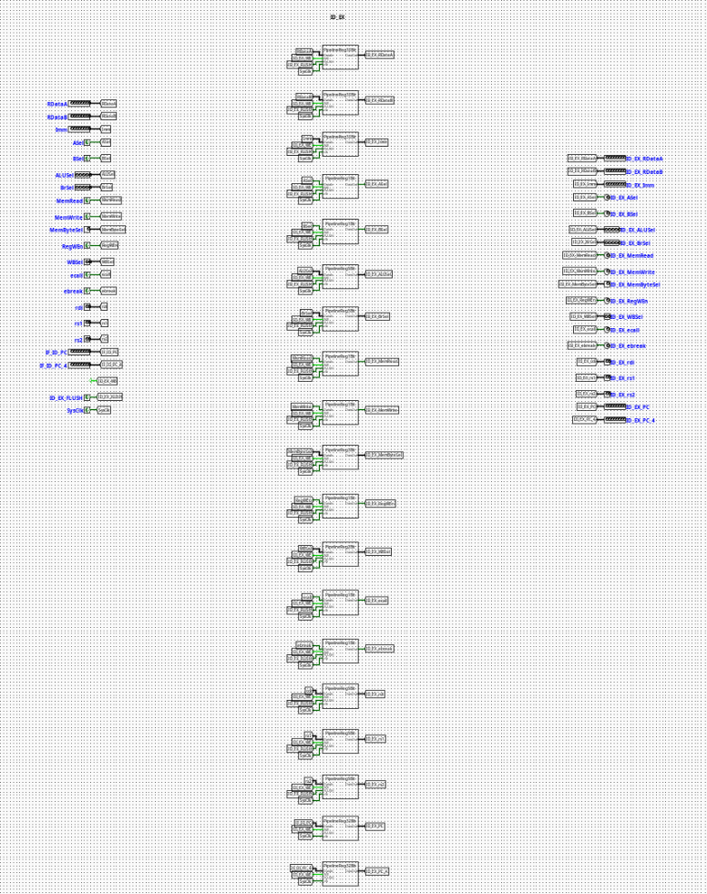

# ID | EX Pipeline Register

---

## Overview

The `ID_EX` component acts as the localized pipeline stage boundary register isolating the Instruction Decode (ID) stage from the Execution (EX) stage of a pipelined RV32I processor. It synchronizes the forward propagation of extracted operands, target register metadata, and parsed execution/memory control lines across clock cycles.

- **Purpose in CPU**: Buffers decoded register data, immediate fields, tracking registers, and control lines to preserve the pipeline state context of an individual instruction moving into execution while the previous fetch-decode structures reset for succeeding instructions.
- **Role in datapath**: Intercepts decoded logic signals exiting the Register File and Main Control unit, holding them static over a clock cycle window before presenting them directly to the ALU, Branch Comparators, and memory stage conduits.

- **Source**: `logisim/RiskVPipelineRegs.circ`
  

---

## Interface

### Inputs

| Signal        | Width   | Description                                                                                                  |
| ------------- | ------- | ------------------------------------------------------------------------------------------------------------ |
| `SysClk`      | 1 bit   | Master system clock line driving all internal edge-triggered sub-registers.                                  |
| `ID_EX_WE`    | 1 bit   | Active-high write enable control bit. When deasserted (`0`), updates are frozen to execute a pipeline stall. |
| `ID_EX_FLUSH` | 1 bit   | Active-high synchronous flush vector. Clears execution contexts and inserts pipeline bubbles.                |
| `ASel`        | 1 bit   | ALU operand A source select flag forwarded from decode logic.                                                |
| `BSel`        | 1 bit   | ALU operand B source select flag forwarded from decode logic.                                                |
| `ALUSel`      | 5 bits  | Precise operational opcode selector specifying ALU core computation variants.                                |
| `BrSel`       | 5 bits  | Condition and type selector flag for the Branch Evaluation Unit.                                             |
| `MemRead`     | 1 bit   | Memory read strobe flag required for down-line load operational gating.                                      |
| `MemWrite`    | 1 bit   | Memory write strobe flag required for data preservation operations.                                          |
| `MemByteSel`  | 3 bits  | Encoded format selector classifying memory dimensions (`lb`, `lh`, `lw`, `lbu`, `lhu`).                      |
| `RegWEn`      | 1 bit   | Register write enable signal intended for the eventual Writeback destination.                                |
| `WBSel`       | 2 bits  | Multi-channel multiplexer selection path index tracking the origin of the writeback data payload.            |
| `ecall`       | 1 bit   | Environment call instruction exception indicator.                                                            |
| `ebreak`      | 1 bit   | Environment break instruction exception indicator.                                                           |
| `rdi`         | 5 bits  | 5-bit raw target destination register address tracking index (`rd`).                                         |
| `rs1`         | 5 bits  | 5-bit source register address tracking index 1 (`rs1`).                                                      |
| `rs2`         | 5 bits  | 5-bit source register address tracking index 2 (`rs2`).                                                      |
| `IF_ID_PC`    | 32 bits | Program Counter tracking position associated with the executing slice.                                       |
| `IF_ID_PC_4`  | 32 bits | Incremented Link/Return address step tracking vector (`PC + 4`).                                             |
| `RDataA`      | 32 bits | Raw data payload 1 read from the Register File location (`rs1`).                                             |
| `RDataB`      | 32 bits | Raw data payload 2 read from the Register File location (`rs2`).                                             |
| `Imm`         | 32 bits | Decompressed scalar immediate payload compiled by the Immediate Generator.                                   |

### Outputs

| Signal             | Width   | Description                                                                                  |
| ------------------ | ------- | -------------------------------------------------------------------------------------------- |
| `ID_EX_ASel`       | 1 bit   | Synchronized ALU operand A select parameter delivered to execution.                          |
| `ID_EX_BSel`       | 1 bit   | Synchronized ALU operand B select parameter delivered to execution.                          |
| `ID_EX_ALUSel`     | 5 bits  | Latched operational selector driving execution-stage ALU multiplexers.                       |
| `ID_EX_BrSel`      | 5 bits  | Latched operational selector driving branch-stage condition testing modules.                 |
| `ID_EX_MemRead`    | 1 bit   | Synchronized load-activation indicator tracking memory execution blocks.                     |
| `ID_EX_MemWrite`   | 1 bit   | Synchronized store-activation indicator tracking memory execution blocks.                    |
| `ID_EX_MemByteSel` | 3 bits  | Latched instruction width modifier parsing access boundaries.                                |
| `ID_EX_RegWEn`     | 1 bit   | Forwarded writeback register destination update tracking parameter.                          |
| `ID_EX_WBSel`      | 2 bits  | Forwarded selection tracking bits for terminal writeback sourcing.                           |
| `ID_EX_ecall`      | 1 bit   | Latched exception indicator signaling execution traps.                                       |
| `ID_EX_ebreak`     | 1 bit   | Latched exception indicator signaling hardware diagnostic steps.                             |
| `ID_EX_rdi`        | 5 bits  | Latched structural index field detailing the target register assignment.                     |
| `ID_EX_rs1`        | 5 bits  | Latched target register pointer tracking address dependencies inside execution hazard nodes. |
| `ID_EX_rs2`        | 5 bits  | Latched target register pointer tracking secondary forwarding paths.                         |
| `ID_EX_PC`         | 32 bits | Latched program tracking coordinate deployed inside relative address branch logic.           |
| `ID_EX_PC_4`       | 32 bits | Latched sequential execution return pointer passed forward to memory stages.                 |
| `ID_EX_RDataA`     | 32 bits | Buffered data payload 1 routing register fields straight to execution stages.                |
| `ID_EX_RDataB`     | 32 bits | Buffered data payload 2 routing register fields straight to execution stages.                |
| `ID_EX_Imm`        | 32 bits | Latched structural immediate vector supplied to processing targets.                          |

---

## Output Logic (Core Definition)

The underlying processing constraints evaluate condition variables synchronously over each master clock edge transition.

### Rule-based definition

- **Synchronous Flush Mode (Branch Misprediction Recovery Trap)**:
  - If `ID_EX_FLUSH` == `1` → All downstream execution control lines (`ID_EX_ASel`, `ID_EX_BSel`, `ID_EX_ALUSel`, `ID_EX_BrSel`, `ID_EX_MemRead`, `ID_EX_MemWrite`, `ID_EX_RegWEn`, `ID_EX_ecall`, `ID_EX_ebreak`) and intermediate indices/scalars are forced synchronously to `0`. This injects a pipeline bubble to drop invalid instruction speculative steps.

- **Standard Gated Latch Mode (Normal Forwarding Path)**:
  - If `ID_EX_FLUSH` == `0` and `ID_EX_WE` == `1` → Outputs cleanly update to match current structural inputs (`ID_EX_X` = `X`).

- **Freeze / Hold Mode (Load-Use Structural Interlock Stall)**:
  - If `ID_EX_FLUSH` == `0` and `ID_EX_WE` == `0` → The components lock status parameters, ignoring active data values shifting across the upstream buses to isolate subsequent pipeline sections until hazards clear.

---

## Internal Design

The circuit architecture isolates discrete data bit-planes by wrapping dedicated register blocks inside modular bit-width sub-circuits.

- **Combinational vs Sequential Structure**: Actual signal preservation transitions over standard sequential edge-triggered Logisim registers. The conditional routing systems, initialization loops, and clear blocks utilize combinational routing elements.
- **Subcircuits Used**:
  - `PipelineReg1Bit` (Encapsulated register architecture matching single control structures)
  - `PipelineReg2Bit` (Tracks `WBSel` pathways)
  - `PipelineReg3Bit` (Tracks `MemByteSel` configurations)
  - `PipelineReg5Bit` (Tracks `rdi`, `rs1`, `rs2`, `ALUSel`, `BrSel` registers)
  - `PipelineReg32Bit` (Tracks standard 32-bit width address and immediate payloads)

- **Gating Framework**: The component structures route state flags natively to internal multiplexers embedded prior to input latch connections. Active tracking lines link `ID_EX_WE` and `ID_EX_FLUSH` parameters across every local stage element via label tunnels, ensuring parallel synchronization of all execution widths.

---

## Operation

Step-by-step behavior:

1. **Signals Present**: Unlatched signals from the registers and control structures settle on input pins.
2. **Control Interception**: Upstream Hazard Unit flags resolve and update `ID_EX_WE` and `ID_EX_FLUSH` tunnel states.
3. **Synchronized Latching**: On the positive edge transition of `SysClk`, internal registers process control configurations, completing standard updates, freezing state fields, or forcing flush lines to 0.
4. **Stable Output Presentation**: Refreshed signals update at the output port boundary, initializing stable data configurations for execution stage logic.

---

## Pipeline Interaction

- **Pipeline stage involvement**: Serves as the primary link dividing the **ID (Instruction Decode)** stage workspace from the active **EX (Execution)** framework.
- **Signal propagation across stages**: Gathers wide configuration arrays and structures them symmetrically into single execution streams, locking active properties from drifting during clock bounds.
- **Dependencies**: Interoperates directly with structural pipeline controllers. When handling control hazards like taken branches or data hazards like unresolved load instructions, the processor stalls or flushes this module to preserve program flow integrity.

---

## Examples

### Example: Executing a Stall under a Load-Use Contention

Inputs:

- `ID_EX_WE` = `0` (Hazard controller forces interlock stall)
- `ID_EX_FLUSH` = `0`
- `ALUSel` = `0x02` (New computation arriving on input line)
- **Current Internal State**: `ID_EX_ALUSel` = `0x00` (ADD instruction currently executing)

Outputs / State Changes:

- **On Next Clock Edge**: Because `ID_EX_WE` is disabled, state transitions are suppressed.
- `ID_EX_ALUSel` stays at `0x00`, forcing the active ALU path to process the current data step for another cycle until hazard paths resolve.

---

## Limitations / Assumptions

- Relies completely on a common, non-skewed system clock network (`SysClk`) to prevent internal bit-plane drift across separate register groups.
- Lacks independent instruction verification mechanisms; relies on upstream control paths to send validated control maps.
- Assumes that the external hazard control engine protects against simultaneous conflicting activations of write controls and flush settings.

---

## Implementation Notes (Logisim)

- Assembled using standard primitives from Logisim-evolution's `Wiring` (Tunnels and Splitters), `Plexers` (Multiplexers), and `Memory` (Registers) libraries.
- Segregates data path traces cleanly by assigning custom submodules to specific data bit-widths, reducing visible wire complexity.
- Employs localized label tunnel buses (`ID_EX_WE`, `ID_EX_FLUSH`, `SysClk`) to maintain a clean, organized circuit layout.

---
