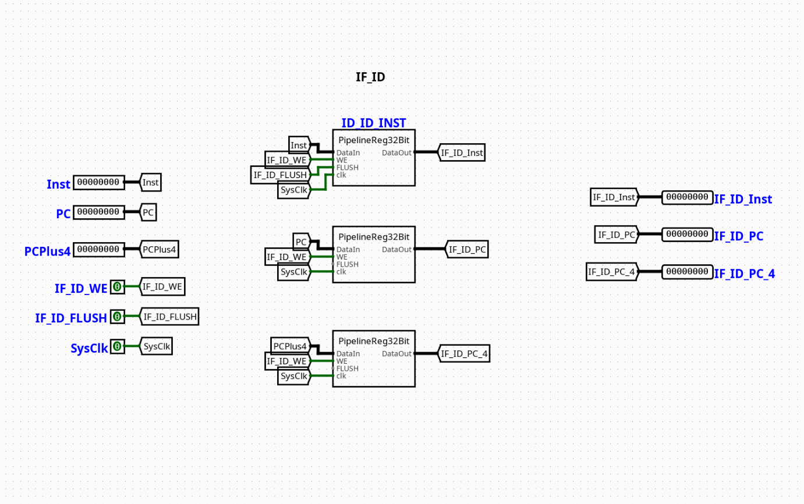

# IF | ID Pipeline Register

---

## Overview

The `IF_ID` component serves as the localized stage boundary register separating the Instruction Fetch (IF) and Instruction Decode (ID) stages of a pipelined RV32I processor. It synchronizes the forward propagation of both the tracked Program Counter (PC) address and the corresponding 32-bit raw instruction machine code captured out of memory, while executing synchronous flushes or hardware freezes under hazard control logic direction.

- **Purpose in CPU**: Buffers the instruction word and current instruction memory address across clock cycles to guarantee stable instruction decoding while isolated execution happens further down the datapath pipeline.
- **Role in datapath**: Receives incoming computational states directly from the Instruction Memory and Program Counter tracking nodes, holding them static during the cycle window before outputting them to the primary Instruction Decoder and Register File address ports.

- **Source**: `logisim/RiskVPipelineRegs.circ`
  

---

## Interface

### Inputs

| Signal       | Width   | Description                                                                                                              |
| ------------ | ------- | ------------------------------------------------------------------------------------------------------------------------ |
| `clk`        | 1 bit   | Master system clock line driving internal edge-triggered register elements.                                              |
| `IFID_Write` | 1 bit   | Active-high write enable control bit. When deasserted (`0`), updates are locked to enforce a pipeline stall.             |
| `IFID_Flush` | 1 bit   | Active-high synchronous clear vector. When asserted (`1`), overrides the input stream to force a hardware NOP insertion. |
| `In_PC`      | 32 bits | Raw execution address from the Program Counter marking the current instruction's location.                               |
| `In_Inst`    | 32 bits | 32-bit machine code payload fetched out of Instruction Memory.                                                           |

### Outputs

| Signal     | Width   | Description                                                                                                  |
| ---------- | ------- | ------------------------------------------------------------------------------------------------------------ |
| `Out_PC`   | 32 bits | Buffered Program Counter address routed downstream to decoding and PC-relative calculation logic.            |
| `Out_Inst` | 32 bits | Latched 32-bit instruction word presented continuously to the control unit and register file address tracks. |

---

## Output Logic (Core Definition)

The behavior of the `IF_ID` stage register is guided on the active clock transition by evaluating the operational priorities of the write mask and flush controllers.

### Rule-based definition

- **Synchronous Purge Mode (Branch Misprediction Recovery)**:
  - If `IFID_Flush` == `1` → `Out_PC` = `0x00000000`, `Out_Inst` = `0x00000013` (Hardwired RISC-V NOP instruction: `addi x0, x0, 0`)

- **Standard Gated Latch Mode (Normal Execution)**:
  - If `IFID_Flush` == `0` and `IFID_Write` == `1` → `Out_PC` = `In_PC`, `Out_Inst` = `In_Inst`

- **Freeze / Hold Mode (Load-Use Dependency Stall)**:
  - If `IFID_Flush` == `0` and `IFID_Write` == `0` → `Out_PC` and `Out_Inst` hold their current internal states, discarding the live input parameters arriving on `In_PC` and `In_Inst`.

---

## Internal Design

The circuit is designed as a structural storage container featuring dual parallel 32-bit edge-triggered registers wrapped by combinational gating multiplexers to implement flushing and stalling behavior.

- **Combinational vs Sequential Structure**: The underlying state preservation uses sequential, edge-triggered registers. The routing logic, write-enable inversion arrays, and flush-injection networks are entirely combinational.
- **Subcircuits Used**:
  - `REG_PC` (Internal 32-bit Register with synchronous enable pin)
  - `REG_INST` (Internal 32-bit Register with synchronous enable pin)
- **Stall & Flush Multiplexing Architecture**: The circuit implements an _input-side intercept_ strategy:
  - **Flush Handling**: The `In_Inst` and `In_PC` lines pass through a pair of 2-to-1 32-bit wide multiplexers selected by the `IFID_Flush` line. The alternative input channels are linked to the constant strings `0x00000013` (NOP) and `0x00000000` (Zero Address).
  - **Stall Handling**: The `IFID_Write` line connects directly to the synchronous enable (`EN`) inputs of the physical register components. When `IFID_Write` transitions to `0`, the clock path is internally masked, preventing any state adjustments from being recorded into the storage matrix.

---

## Operation

Step-by-step behavior:

1. **Parameters Arrive**: Fetch-stage variables (`In_PC`, `In_Inst`) settle on the input buses, while hazard state indicators (`IFID_Write`, `IFID_Flush`) arrive from the central hazard unit.
2. **Combinational Interception**: The internal multiplexers evaluate the state of `IFID_Flush`. If active, the system instruction word is suppressed and replaced with the hardware NOP bit pattern.
3. **Clock Boundary Processing**: On the active clock transition, the edge-triggered registers analyze the status of the `IFID_Write` pin. If high, the data present at the multiplexer outputs latches into storage.
4. **Stable Downstream Delivery**: The latched states propagate to `Out_PC` and `Out_Inst`, providing clean, ripple-free paths for the downstream instruction decoders throughout the rest of the execution cycle.

---

## Pipeline Interaction

- **Pipeline stage involvement**: Acts explicitly as the structural boundary crossing point connecting the **IF (Instruction Fetch)** stage to the **ID (Instruction Decode)** stage.
- **Signal propagation across stages**: Unpacks raw block data arriving out of instruction memory and maps it neatly to localized control pipelines.
- **Dependencies**: Interoperates directly with the processor's hazard controller. If a branch is taken or an unforwardable data dependency is encountered, the hazard controller manipulates the `IFID_Flush` and `IFID_Write` pins to flush the branch slot or freeze the current fetch state.

---

## Examples

### Example: Stalling on a Load-Use Hazard

Inputs:

- `In_PC` = `0x0000001C` (Next instruction fetched in sequence)
- `In_Inst` = `0x00A502B3` (Dependent instruction)
- `IFID_Write` = `0` (Hazard controller detects a load-use conflict and triggers a stall)
- `IFID_Flush` = `0`
- **Current Internal Latched State**: `Out_PC` = `0x00000018`, `Out_Inst` = `0x00520233`

Outputs / State Changes:

- **On Next Clock Edge**: Because `IFID_Write` is `0`, the update is blocked. The internal register states remain unchanged.
- `Out_PC` remains `0x00000018`
- `Out_Inst` remains `0x00520233` (The instruction is held in the Decode stage for an additional cycle to allow the load hazard to resolve)

---

## Limitations / Assumptions

- Assumes that the hazard management unit does not simultaneously assert `IFID_Write = 0` and `IFID_Flush = 1`, as flushing requires a register write operation to commit the NOP value.
- Lacks independent byte-lane slicing; operations occur strictly on full 32-bit instruction words.
- Relies on a clean, centralized system clock network to ensure that clock transitions happen only after all data and control inputs have fully stabilized.

---

## Implementation Notes

- Assembled from standard elements within Logisim's native `Memories` (Registers), `Plexers` (Multiplexers), and `Wiring` (Constants/Pins) toolboxes.
- Utilizes 32-bit wide bus paths for all primary instruction and address lines.
- Uses local label tunnels to systematically distribute the stage controls, avoiding messy wiring layout overlaps.

---
