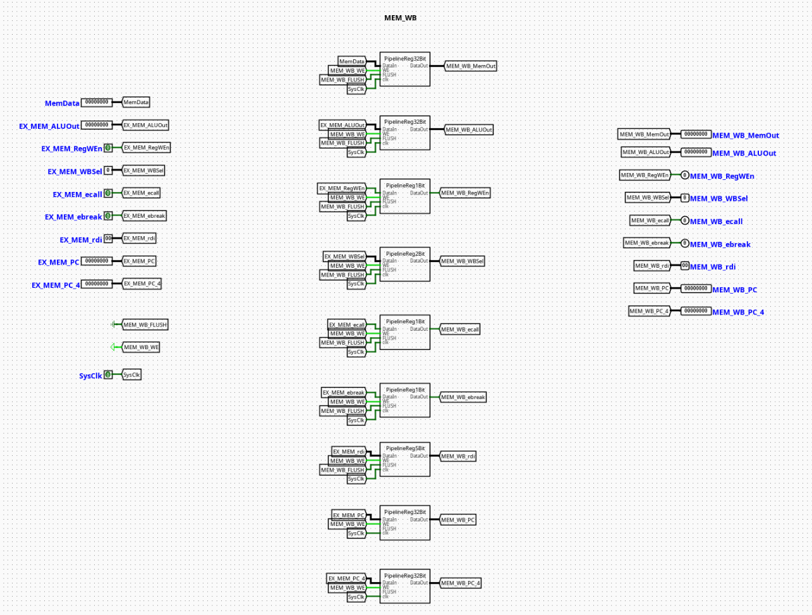

# MEM | WB Pipeline Register

---

## Overview

The `MEM_WB` component serves as the terminal pipeline stage boundary register isolating the Memory Access (MEM) stage from the Writeback (WB) stage of a pipelined RV32I processor. It acts as a synchronous stabilization barrier that captures memory-load results, arithmetic operations, and register tracking metadata at the end of the memory cycle to prepare them for commit.

- **Purpose in CPU**: Buffers execution metrics, destination register pointers, and writeback routing controls across clock boundaries to guarantee stable register file updates while succeeding instructions advance into the memory access stage.
- **Role in datapath**: Latches data outputs returning from Data Memory alongside direct ALU bypass payloads, holding them static for a full cycle before passing them into the Writeback Controller selection network.

- **Source**: `logisim/RiskVPipelineRegs.circ`
  

---

## Interface

### Inputs

| Signal         | Width   | Description                                                                                                  |
| -------------- | ------- | ------------------------------------------------------------------------------------------------------------ |
| `SysClk`       | 1 bit   | Master system clock line driving all internal edge-triggered sub-registers.                                  |
| `MEM_WB_WE`    | 1 bit   | Active-high write enable control bit. When deasserted (`0`), updates are frozen to enforce a pipeline stall. |
| `MEM_WB_FLUSH` | 1 bit   | Active-high synchronous flush vector. Overrides incoming tracks to inject a pipeline bubble.                 |
| `RegWEn`       | 1 bit   | Register write enable signal intended for the eventual Register File writeback validation.                   |
| `WBSel`        | 2 bits  | Multi-channel multiplexer selection path index tracking the origin of the writeback data payload.            |
| `ecall`        | 1 bit   | Environment call instruction exception indicator forwarded for downstream trap management.                   |
| `ebreak`       | 1 bit   | Environment break instruction exception indicator forwarded for downstream diagnostic handling.              |
| `rdi`          | 5 bits  | 5-bit target destination register address tracking index (`rd`).                                             |
| `ALURes`       | 32 bits | Raw computational result or calculated memory address bypassed from upstream stages.                         |
| `MemRData`     | 32 bits | Formatted data word returned from the Data Memory (DMem) read alignment framework.                           |
| `PC_4`         | 32 bits | Incremented Link/Return address step tracking vector (`PC + 4`) carried down from the fetch stage.           |

### Outputs

| Signal            | Width   | Description                                                                                            |
| ----------------- | ------- | ------------------------------------------------------------------------------------------------------ |
| `MEM_WB_RegWEn`   | 1 bit   | Synchronized writeback register destination update flag delivered to the Register File write port.     |
| `MEM_WB_WBSel`    | 2 bits  | Latched selection tracking bits driving the Writeback selection multiplexer.                           |
| `MEM_WB_ecall`    | 1 bit   | Latched exception indicator signaling terminal instruction traps.                                      |
| `MEM_WB_ebreak`   | 1 bit   | Latched exception indicator signaling terminal hardware diagnostic breaks.                             |
| `MEM_WB_rdi`      | 5 bits  | Latched structural index field detailing the target register assignment (`rd`) for writeback routing.  |
| `MEM_WB_ALURes`   | 32 bits | Latched arithmetic outcome delivered to channel 00 of the writeback selection matrix.                  |
| `MEM_WB_MemRData` | 32 bits | Latched data memory read word delivered to channel 01 of the writeback selection matrix.               |
| `MEM_WB_PC_4`     | 32 bits | Latched sequential execution return pointer delivered to channel 11 of the writeback selection matrix. |

---

## Output Logic (Core Definition)

The underlying processing constraints evaluate condition variables synchronously over each master clock edge transition.

### Rule-based definition

- **Synchronous Flush Mode**:
  - If `MEM_WB_FLUSH` == `1` → All output data channels, target register indices, and control flags are forced synchronously to `0`. This injects an execution bubble into the writeback phase, disabling the register write enable line (`MEM_WB_RegWEn` = `0`) to prevent state corruption during an exception or late pipeline recovery.

- **Standard Gated Latch Mode**:
  - If `MEM_WB_FLUSH` == `0` and `MEM_WB_WE` == `1` → Outputs update cleanly to match the active incoming datapath fields (`MEM_WB_X` = `X`).

- **Freeze / Hold Mode**:
  - If `MEM_WB_FLUSH` == `0` and `MEM_WB_WE` == `0` → The component locks its current state registers, ignoring updates on the input buses to hold the writeback context constant until hazards clear.

---

## Internal Design

The circuit architecture isolates discrete data bit-planes by nesting uniform register blocks inside dedicated submodules mapped to specific widths.

- **Combinational vs Sequential Structure**: Actual state containment transitions over standard sequential edge-triggered Logisim registers. The conditional clear loops, input-intercept multiplexers, and write-enable distribution systems are completely combinational.
- **Subcircuits Used**:
  - `PipelineReg1Bit` (Encapsulates a single-bit register with built-in flush multiplexing for basic flags)
  - `PipelineReg2Bit` (Manages the 2-bit `WBSel` signal track)
  - `PipelineReg5Bit` (Manages the 5-bit `rdi` target register index)
  - `PipelineReg32Bit` (Buffers the wide 32-bit `ALURes`, `MemRData`, and `PC_4` busses)

- **Gating Framework**: Each bit-plane width variant utilizes an _input-side multiplexing_ layout. Asserting `MEM_WB_FLUSH` changes the selection on internal 2-to-1 multiplexers placed right before the register input pins, diverting the storage targets away from live data and into constant zero blocks. Local control paths distribute `MEM_WB_WE`, `MEM_WB_FLUSH`, and `SysClk` in parallel across all internal blocks using unified label tunnels.

---

## Operation

Step-by-step behavior:

1. **Signals Present**: Read data from memory, bypassed computation results from the ALU, link addresses, destination indexes, and control maps settle on the input pins.
2. **Control Evaluation**: Hazard controller states establish the conditions of the `MEM_WB_WE` and `MEM_WB_FLUSH` tracking lines.
3. **Synchronized Latching**: On the positive edge transition of `SysClk`, internal registers process the active controls—either latching new inputs, locking current values, or wiping fields to zero if flushed.
4. **Stable Output Presentation**: Refreshed signals update at the output ports, initializing clean register address indexes, return payloads, and write enables for the Writeback Controller and the main Register File.

---

## Pipeline Interaction

- **Pipeline stage involvement**: Links the **MEM (Memory Access)** stage workspace directly with the **WB (Writeback)** terminal stage framework.
- **Signal propagation across stages**: Packs diverse resource channels to pass them smoothly to the register file update architecture, isolating the writeback commit phase from combinational fluctuations occurring during memory bus transitions.
- **Dependencies**: Operates as a critical monitoring node for hazard detection. The latched destination register index (`MEM_WB_rdi`) and register write enable status (`MEM_WB_RegWEn`) are routed backwards to upstream Execution and Decode forwarding units to resolve data hazards via bypass networks.

---

## Examples

### Example: Completing a Load Word Instruction (`lw x5, 8(x10)`)

Inputs:

- `MEM_WB_WE` = `1`, `MEM_WB_FLUSH` = `0`
- `RegWEn` = `1`, `WBSel` = `01` (Select Memory data for writeback)
- `MemRData` = `0x12345678` (Data word loaded from memory)
- `ALURes` = `0x10000008` (Computed address, bypassed but ignored for writeback data payload)
- `PC_4` = `0x00000044`
- `rdi` = `0x05` (Target register index `x5`)

Outputs / State Changes:

- **On Next Clock Edge**: Internal registers capture the active parameters.
- `MEM_WB_MemRData` becomes `0x12345678` (Presents payload to writeback mux).
- `MEM_WB_rdi` becomes `0x05` (Specifies destination register index `x5`).
- `MEM_WB_RegWEn` transitions high to authorize the write commit into the register file.

---

## Limitations / Assumptions

- Assumes a well-timed, non-skewed system clock layout (`SysClk`) to prevent propagation racing between parallel bit-width slices.
- Does not contain independent validation logic for destination targets or data fields; assumes upstream exception handling manages out-of-bounds metrics.
- Assumes the external control engine prevents conflicting simultaneous assertions of write-enable and flush states.

---

## Implementation Notes (Logisim)

- Engineered using standard primitives from Logisim-evolution's `Memory` (Registers), `Plexers` (Multiplexers), and `Wiring` (Splitters/Tunnels) toolsets.
- Cleanly compartmentalizes wiring by allocating custom sub-register blocks for specific bit widths.
- Employs local label tunnels to systematically route control parameters (`SysClk`, `MEM_WB_WE`, `MEM_WB_FLUSH`), eliminating crossed lines and ensuring a clean visual structure.

---
